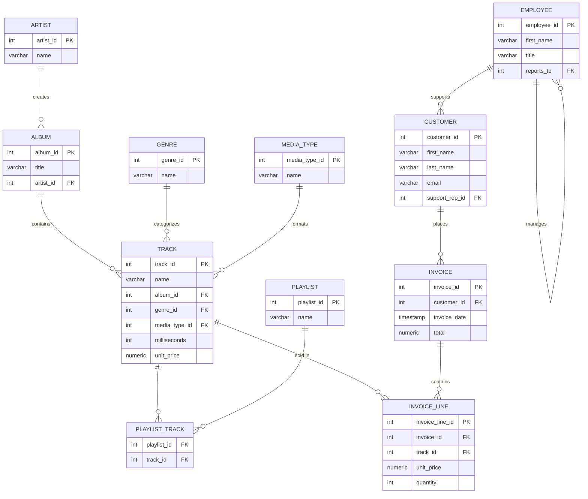

# SQL Notes

Personal SQL reference notes covering PostgreSQL and MySQL.

---

## PostgreSQL

### Quick Start — Local Practice Environment

Run a local PostgreSQL instance with the **Chinook** sample database (music store, 11 tables, ~20k rows) using Docker:

```powershell
# 1. Start PostgreSQL container
docker run -d --name chinook-pg -e POSTGRES_PASSWORD=postgres -p 5432:5432 postgres:17

# 2. Download Chinook dataset
Invoke-WebRequest `
  -Uri "https://raw.githubusercontent.com/lerocha/chinook-database/master/ChinookDatabase/DataSources/Chinook_PostgreSql.sql" `
  -OutFile "Chinook_PostgreSql.sql"

# 3. Import
docker cp Chinook_PostgreSql.sql chinook-pg:/tmp/
docker exec -it chinook-pg psql -U postgres -c "CREATE DATABASE chinook;"
docker exec -it chinook-pg psql -U postgres -d chinook -f /tmp/Chinook_PostgreSql.sql

# 4. Connect
docker exec -it chinook-pg psql -U postgres -d chinook
```

**DBeaver connection:** `localhost:5432 / db: chinook / user: postgres / pw: postgres`

See [postgresql/guide.md](postgresql/guide.md) for the full setup guide and 20 practice exercises.

---

### Chinook Database Schema



---

### Reference Notes

| File | Topics |
|------|--------|
| [01 — Connection & Databases](postgresql/01_基础连接与数据库.md) | psql commands, databases, schemas, system queries |
| [02 — Data Types](postgresql/02_数据类型.md) | Numeric, text, date, boolean, UUID, **array**, **JSONB**, range |
| [03 — Basic Queries](postgresql/03_基础查询.md) | SELECT, WHERE, ILIKE, regex `~`, ORDER BY NULLS, GROUP BY |
| [04 — Advanced Queries](postgresql/04_高级查询.md) | JOINs, subqueries, **CTEs**, **window functions**, LATERAL |
| [05 — DDL](postgresql/05_DDL表操作.md) | CREATE/ALTER/DROP, constraints, sequences, partitioning |
| [06 — Views & Indexes](postgresql/06_视图与索引.md) | Views, **materialized views**, B-Tree/GIN/BRIN, EXPLAIN |
| [07 — Functions & Procedures](postgresql/07_函数与存储过程.md) | PL/pgSQL, functions, procedures, triggers, cursors |
| [08 — Transactions](postgresql/08_事务.md) | BEGIN/COMMIT/ROLLBACK, savepoints, isolation levels, MVCC |
| [09 — Users & Permissions](postgresql/09_用户与权限.md) | Roles, GRANT/REVOKE, role inheritance, **Row Level Security** |
| [10 — PostgreSQL Features](postgresql/10_特色功能.md) | UPSERT, RETURNING, extensions, LISTEN/NOTIFY, MySQL vs PG |

---

## MySQL

Notes based on *MySQL Must Know Must Have* — covers MySQL 5.x fundamentals with MySQL 8.x updates.

→ [mysql/README.md](mysql/README.md)
