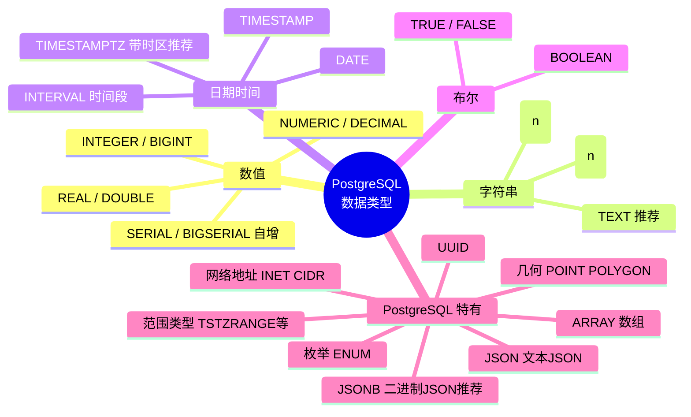

# PostgreSQL 数据类型

PostgreSQL 拥有比 MySQL 更丰富的数据类型，包括数组、JSON、UUID、范围类型等。

[TOC]

## 数据类型全览



## 数值类型

| 类型 | 说明 | 范围 |
|------|------|------|
| `SMALLINT` | 小整数 | -32768 ~ 32767 |
| `INTEGER` / `INT` | 整数 | -2^31 ~ 2^31-1 |
| `BIGINT` | 大整数 | -2^63 ~ 2^63-1 |
| `DECIMAL(p,s)` / `NUMERIC(p,s)` | 精确小数 | 可变精度 |
| `REAL` | 单精度浮点 | 6位精度 |
| `DOUBLE PRECISION` | 双精度浮点 | 15位精度 |
| `SMALLSERIAL` | 自增小整数 | 1 ~ 32767 |
| `SERIAL` | 自增整数 | 1 ~ 2^31-1 |
| `BIGSERIAL` | 自增大整数 | 1 ~ 2^63-1 |

```sql
CREATE TABLE products (
    prod_id    SERIAL PRIMARY KEY,          -- 自动自增（等同于 MySQL AUTO_INCREMENT）
    prod_code  CHAR(10) NOT NULL,
    prod_price NUMERIC(10, 2) NOT NULL,     -- 精确小数，推荐用于货币
    rating     REAL,                         -- 浮点数
    stock      INTEGER DEFAULT 0
);

-- SERIAL 本质上是 SEQUENCE 的语法糖：
-- 等同于：
CREATE SEQUENCE products_prod_id_seq;
CREATE TABLE products (
    prod_id INTEGER NOT NULL DEFAULT nextval('products_prod_id_seq')
);
```

## 字符类型

| 类型 | 说明 |
|------|------|
| `CHAR(n)` | 定长字符串，不足时补空格 |
| `VARCHAR(n)` | 变长字符串，最大 n 个字符 |
| `TEXT` | 无限长度文本（推荐，PostgreSQL 无性能差异） |

```sql
-- PostgreSQL 中 TEXT 与 VARCHAR 性能相同，推荐使用 TEXT
CREATE TABLE customers (
    cust_id      SERIAL PRIMARY KEY,
    cust_name    VARCHAR(100) NOT NULL,
    cust_address TEXT,
    cust_note    TEXT
);

-- 字符串函数
SELECT LENGTH('hello');          -- 5
SELECT CHAR_LENGTH('hello');     -- 5（同 LENGTH）
SELECT UPPER('hello');           -- HELLO
SELECT LOWER('HELLO');           -- hello
SELECT TRIM('  hello  ');        -- hello
SELECT LTRIM('  hello');         -- hello
SELECT RTRIM('hello  ');         -- hello
SELECT SUBSTRING('hello' FROM 2 FOR 3);  -- ell
SELECT LEFT('hello', 3);         -- hel
SELECT RIGHT('hello', 3);        -- llo
SELECT REPEAT('ab', 3);          -- ababab
SELECT REPLACE('hello world', 'world', 'pg');  -- hello pg
SELECT CONCAT('Hello', ' ', 'World');           -- Hello World
SELECT 'Hello' || ' ' || 'World';              -- Hello World（PostgreSQL 拼接运算符）
SELECT LPAD('42', 5, '0');       -- 00042
SELECT RPAD('42', 5, '0');       -- 42000
```

## 日期时间类型

| 类型 | 说明 | 示例 |
|------|------|------|
| `DATE` | 日期 | 2024-01-15 |
| `TIME` | 时间 | 13:30:00 |
| `TIMESTAMP` | 日期时间（不含时区） | 2024-01-15 13:30:00 |
| `TIMESTAMPTZ` | 日期时间（含时区，推荐） | 2024-01-15 13:30:00+08 |
| `INTERVAL` | 时间间隔 | '1 year 2 months 3 days' |

```sql
-- 日期时间示例
CREATE TABLE orders (
    order_id    SERIAL PRIMARY KEY,
    order_date  TIMESTAMPTZ NOT NULL DEFAULT NOW(),
    ship_date   DATE,
    duration    INTERVAL
);

-- 常用日期时间函数
SELECT NOW();                           -- 当前时间（含时区）
SELECT CURRENT_TIMESTAMP;               -- 同 NOW()
SELECT CURRENT_DATE;                    -- 当前日期
SELECT CURRENT_TIME;                    -- 当前时间

-- 提取日期部分
SELECT EXTRACT(YEAR FROM NOW());        -- 年
SELECT EXTRACT(MONTH FROM NOW());       -- 月
SELECT EXTRACT(DAY FROM NOW());         -- 日
SELECT EXTRACT(DOW FROM NOW());         -- 星期几（0=周日）
SELECT DATE_PART('hour', NOW());        -- 时（同 EXTRACT）

-- 日期格式化
SELECT TO_CHAR(NOW(), 'YYYY-MM-DD HH24:MI:SS');  -- 2024-01-15 13:30:00
SELECT TO_CHAR(NOW(), 'YYYY年MM月DD日');

-- 日期计算
SELECT NOW() + INTERVAL '1 day';
SELECT NOW() - INTERVAL '1 month 3 days';
SELECT '2024-12-31'::DATE - '2024-01-01'::DATE;   -- 365（天数差）
SELECT AGE('2024-12-31', '2024-01-01');            -- 11 mons 30 days

-- 日期截断
SELECT DATE_TRUNC('month', NOW());      -- 截断到月初
SELECT DATE_TRUNC('year', NOW());       -- 截断到年初
SELECT DATE_TRUNC('hour', NOW());       -- 截断到小时

-- 字符串转日期
SELECT TO_DATE('2024-01-15', 'YYYY-MM-DD');
SELECT '2024-01-15'::DATE;              -- 类型转换语法
```

## 布尔类型

```sql
-- PostgreSQL 有真正的 BOOLEAN 类型（MySQL 用 TINYINT(1) 模拟）
CREATE TABLE items (
    id        SERIAL PRIMARY KEY,
    is_active BOOLEAN NOT NULL DEFAULT TRUE,
    is_deleted BOOLEAN NOT NULL DEFAULT FALSE
);

-- 有效的 TRUE 值：TRUE, 't', 'true', 'y', 'yes', 'on', '1'
-- 有效的 FALSE 值：FALSE, 'f', 'false', 'n', 'no', 'off', '0'
INSERT INTO items(is_active) VALUES (TRUE);
INSERT INTO items(is_active) VALUES ('yes');

SELECT * FROM items WHERE is_active = TRUE;
SELECT * FROM items WHERE is_active;          -- 简写
SELECT * FROM items WHERE NOT is_active;      -- 简写
```

## UUID 类型

```sql
-- 需要启用扩展
CREATE EXTENSION IF NOT EXISTS "uuid-ossp";
CREATE EXTENSION IF NOT EXISTS pgcrypto;

CREATE TABLE users (
    user_id  UUID PRIMARY KEY DEFAULT gen_random_uuid(),  -- pgcrypto
    -- 或者
    -- user_id UUID PRIMARY KEY DEFAULT uuid_generate_v4(),  -- uuid-ossp
    username VARCHAR(50) NOT NULL
);

-- 手动生成 UUID
SELECT gen_random_uuid();
SELECT uuid_generate_v4();
```

## 数组类型

PostgreSQL 原生支持数组，这是 MySQL 没有的特性。

```sql
CREATE TABLE products (
    prod_id  SERIAL PRIMARY KEY,
    name     TEXT NOT NULL,
    tags     TEXT[],            -- 文本数组
    scores   INTEGER[],         -- 整数数组
    matrix   INTEGER[][]        -- 多维数组
);

-- 插入数组
INSERT INTO products(name, tags, scores)
VALUES ('Widget', ARRAY['sale', 'new', 'featured'], ARRAY[95, 87, 92]);

INSERT INTO products(name, tags)
VALUES ('Gadget', '{"electronics", "portable"}');  -- 另一种语法

-- 查询数组
SELECT name, tags[1] FROM products;        -- 数组下标从 1 开始（不是 0！）
SELECT name FROM products WHERE 'sale' = ANY(tags);   -- 包含某元素
SELECT name FROM products WHERE tags @> ARRAY['sale', 'new'];  -- 包含所有
SELECT name FROM products WHERE tags && ARRAY['sale', 'old'];  -- 有交集

-- 数组函数
SELECT array_length(tags, 1) FROM products;          -- 数组长度
SELECT unnest(tags) FROM products;                   -- 展开数组为行
SELECT array_append(tags, 'clearance') FROM products; -- 追加元素
SELECT array_cat(ARRAY[1,2], ARRAY[3,4]);             -- 合并数组
SELECT 5 = ANY(ARRAY[1,2,3,4,5]);                    -- TRUE
```

## JSON / JSONB 类型

PostgreSQL 的 JSONB（二进制 JSON）性能优于 MySQL 的 JSON。

```sql
CREATE TABLE events (
    id      SERIAL PRIMARY KEY,
    data    JSONB NOT NULL,          -- JSONB：存储为二进制，支持索引，推荐
    raw     JSON                     -- JSON：存储原始文本，保留格式
);

-- 插入 JSON
INSERT INTO events(data) VALUES
('{"user": "alice", "action": "login", "tags": ["web", "mobile"], "meta": {"ip": "1.2.3.4"}}');

-- 查询操作符
SELECT data->'user' FROM events;          -- 返回 JSON 值："alice"
SELECT data->>'user' FROM events;         -- 返回文本值：alice
SELECT data->'meta'->>'ip' FROM events;   -- 嵌套访问
SELECT data#>>'{meta,ip}' FROM events;    -- 路径访问

-- 过滤
SELECT * FROM events WHERE data->>'user' = 'alice';
SELECT * FROM events WHERE data @> '{"action": "login"}';  -- 包含
SELECT * FROM events WHERE data ? 'user';                   -- 键存在

-- 修改 JSONB
UPDATE events SET data = data || '{"status": "active"}';    -- 合并
UPDATE events SET data = data - 'raw_field';                -- 删除键
UPDATE events SET data = jsonb_set(data, '{meta,city}', '"Beijing"');

-- JSONB 聚合
SELECT jsonb_agg(data) FROM events;
SELECT jsonb_object_agg(data->>'user', data->>'action') FROM events;

-- 创建 JSONB 索引（GIN 索引，支持 @> 和 ? 操作）
CREATE INDEX idx_events_data ON events USING GIN (data);
CREATE INDEX idx_events_user ON events ((data->>'user'));  -- 特定字段索引
```

## 范围类型

```sql
-- 范围类型（MySQL 没有）
CREATE TABLE reservations (
    id          SERIAL PRIMARY KEY,
    room_id     INTEGER NOT NULL,
    period      TSTZRANGE NOT NULL,    -- 时间戳范围
    price_range NUMRANGE               -- 数值范围
);

INSERT INTO reservations(room_id, period)
VALUES (101, '[2024-01-15 14:00, 2024-01-17 12:00)');

-- 范围操作符
SELECT * FROM reservations
WHERE period @> '2024-01-16 10:00'::TIMESTAMPTZ;   -- 包含某时刻

SELECT * FROM reservations
WHERE period && '[2024-01-16, 2024-01-18)'::TSTZRANGE;  -- 时间段重叠

-- 排除约束（防止预订冲突）
ALTER TABLE reservations
ADD CONSTRAINT no_overlap EXCLUDE USING GIST (room_id WITH =, period WITH &&);
```

## 其他常用类型

```sql
-- 网络地址类型
CREATE TABLE servers (
    id      SERIAL PRIMARY KEY,
    ip      INET,           -- IP 地址（IPv4/IPv6）
    mac     MACADDR,        -- MAC 地址
    network CIDR            -- 网络地址
);

INSERT INTO servers(ip, network) VALUES ('192.168.1.100', '192.168.1.0/24');

-- 枚举类型
CREATE TYPE mood AS ENUM ('happy', 'sad', 'neutral');
CREATE TABLE person (
    id      SERIAL PRIMARY KEY,
    name    TEXT,
    feeling mood
);

-- 几何类型
CREATE TABLE shapes (
    id      SERIAL PRIMARY KEY,
    center  POINT,          -- 点
    area    CIRCLE,         -- 圆
    region  POLYGON         -- 多边形
);
```

## 类型转换

```sql
-- PostgreSQL 强类型，需要显式转换
-- 两种等效写法：
SELECT '123'::INTEGER;                      -- PostgreSQL 风格（推荐）
SELECT CAST('123' AS INTEGER);             -- 标准 SQL 风格

SELECT '2024-01-15'::DATE;
SELECT NOW()::DATE;
SELECT 3.14::NUMERIC(5,2);
SELECT 100::TEXT;

-- TO_NUMBER / TO_CHAR / TO_DATE
SELECT TO_NUMBER('1,234.56', '9,999.99');  -- 1234.56
SELECT TO_CHAR(1234.5, 'FM9,999.00');      -- 1,234.50
```
