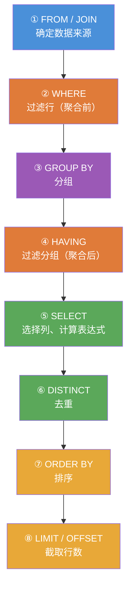

# PostgreSQL 基础查询

[TOC]

## SELECT 语句执行顺序

写 SQL 的顺序 vs 实际执行顺序不同，理解这个是避免报错的关键：



> **常见错误**：在 WHERE 里用聚合函数（如 `WHERE COUNT(*) > 2`）会报错，因为 WHERE 在 GROUP BY 之前执行，应该用 **HAVING**。

## SELECT 语句

```sql
-- 检索单列
SELECT prod_name FROM products;

-- 检索多列
SELECT prod_id, prod_name, prod_price FROM products;

-- 检索所有列
SELECT * FROM products;

-- 去重
SELECT DISTINCT vend_id FROM products;

-- 列别名（AS 可省略，但建议保留）
SELECT prod_name AS name, prod_price AS price FROM products;

-- 表别名
SELECT p.prod_name, v.vend_name
FROM products AS p
JOIN vendors AS v ON p.vend_id = v.vend_id;
```

## LIMIT 与 OFFSET

```sql
-- PostgreSQL 使用 LIMIT / OFFSET（MySQL 的 LIMIT x,y 在 PostgreSQL 中不支持）
SELECT prod_name FROM products LIMIT 5;            -- 返回前 5 行
SELECT prod_name FROM products LIMIT 5 OFFSET 10; -- 跳过10行，取5行
SELECT prod_name FROM products LIMIT ALL;          -- 取所有行（可用于仅指定 OFFSET）
SELECT prod_name FROM products OFFSET 5;           -- 跳过前5行，取所有
```

## WHERE 子句

```sql
-- 基本比较
SELECT prod_name, prod_price FROM products WHERE prod_price = 2.50;
SELECT prod_name, prod_price FROM products WHERE prod_price < 10;
SELECT prod_name, prod_price FROM products WHERE prod_price <> 10;  -- 不等于
SELECT prod_name, prod_price FROM products WHERE prod_price != 10;  -- 同上

-- BETWEEN
SELECT prod_name, prod_price FROM products
WHERE prod_price BETWEEN 5 AND 10;

-- IN
SELECT prod_name FROM products WHERE vend_id IN (1001, 1002, 1003);

-- NOT IN
SELECT prod_name FROM products WHERE vend_id NOT IN (1001, 1002);

-- IS NULL / IS NOT NULL
SELECT prod_name FROM products WHERE prod_price IS NULL;
SELECT prod_name FROM products WHERE prod_price IS NOT NULL;

-- AND / OR / NOT
SELECT * FROM products WHERE vend_id = 1003 AND prod_price <= 10;
SELECT * FROM products WHERE vend_id = 1002 OR vend_id = 1003;
SELECT * FROM products WHERE NOT (vend_id = 1001 OR vend_id = 1002);

-- ANY / ALL（与子查询配合）
SELECT prod_name FROM products
WHERE prod_price > ANY (SELECT prod_price FROM products WHERE vend_id = 1002);

SELECT prod_name FROM products
WHERE prod_price > ALL (SELECT prod_price FROM products WHERE vend_id = 1002);
```

## 字符串匹配

```sql
-- LIKE（与 MySQL 相同）
SELECT prod_name FROM products WHERE prod_name LIKE 'jet%';    -- 以 jet 开头
SELECT prod_name FROM products WHERE prod_name LIKE '%anvil%'; -- 包含 anvil
SELECT prod_name FROM products WHERE prod_name LIKE '___ ton anvil'; -- _ 匹配单字符

-- ILIKE（不区分大小写，PostgreSQL 特有，MySQL 无）
SELECT prod_name FROM products WHERE prod_name ILIKE 'jet%';  -- 不区分大小写

-- 正则表达式（PostgreSQL 正则语法与 MySQL 有差异）
-- ~ 匹配（区分大小写），!~ 不匹配
-- ~* 匹配（不区分大小写），!~* 不匹配
SELECT prod_name FROM products WHERE prod_name ~ '^[0-9]';     -- 以数字开头
SELECT prod_name FROM products WHERE prod_name ~* 'anvil';     -- 包含 anvil（不区分大小写）
SELECT prod_name FROM products WHERE prod_name !~ 'anvil';     -- 不包含 anvil

-- SIMILAR TO（介于 LIKE 和正则之间，使用 SQL 标准正则语法）
SELECT prod_name FROM products WHERE prod_name SIMILAR TO '%(anvil|Anvil)%';

-- REGEXP_LIKE / REGEXP_REPLACE（PostgreSQL 16+）
SELECT REGEXP_LIKE('Hello World', 'world', 'i');  -- true（i 表示不区分大小写）
SELECT REGEXP_REPLACE('Hello 123 World', '[0-9]+', 'NUM');  -- Hello NUM World
SELECT REGEXP_MATCHES('abc123def456', '[0-9]+', 'g');       -- 返回所有匹配
```

## ORDER BY

```sql
-- 升序（默认）
SELECT prod_name FROM products ORDER BY prod_name;

-- 降序
SELECT prod_name, prod_price FROM products ORDER BY prod_price DESC;

-- 多列排序
SELECT prod_id, prod_price, prod_name FROM products
ORDER BY prod_price DESC, prod_name ASC;

-- 按列序号排序（不推荐，但有效）
SELECT prod_id, prod_price, prod_name FROM products ORDER BY 2 DESC, 3;

-- NULLS FIRST / NULLS LAST（PostgreSQL 特有，控制 NULL 排序位置）
-- 默认升序时 NULL 排最后，降序时 NULL 排最前
SELECT prod_name, prod_price FROM products
ORDER BY prod_price DESC NULLS LAST;

SELECT prod_name, prod_price FROM products
ORDER BY prod_price ASC NULLS FIRST;
```

## 聚合函数

```sql
-- 基本聚合
SELECT COUNT(*) FROM products;
SELECT COUNT(prod_price) FROM products;      -- 忽略 NULL
SELECT COUNT(DISTINCT vend_id) FROM products;

SELECT AVG(prod_price) FROM products;
SELECT MAX(prod_price) FROM products;
SELECT MIN(prod_price) FROM products;
SELECT SUM(prod_price) FROM products;

-- 组合聚合
SELECT
    COUNT(*) AS total_products,
    AVG(prod_price) AS avg_price,
    MAX(prod_price) AS max_price,
    MIN(prod_price) AS min_price,
    SUM(prod_price) AS total_price
FROM products;

-- STRING_AGG：将字符串聚合为一个值（MySQL 中用 GROUP_CONCAT）
SELECT vend_id, STRING_AGG(prod_name, ', ' ORDER BY prod_name) AS product_list
FROM products
GROUP BY vend_id;

-- ARRAY_AGG：聚合为数组
SELECT vend_id, ARRAY_AGG(prod_name ORDER BY prod_name) AS products
FROM products
GROUP BY vend_id;

-- BOOL_AND / BOOL_OR
SELECT vend_id, BOOL_AND(prod_price > 5) AS all_above_5
FROM products GROUP BY vend_id;
```

## GROUP BY 与 HAVING

```sql
-- GROUP BY
SELECT vend_id, COUNT(*) AS num_prods
FROM products
GROUP BY vend_id;

-- HAVING（过滤分组）
SELECT vend_id, COUNT(*) AS num_prods
FROM products
GROUP BY vend_id
HAVING COUNT(*) >= 2;

-- WHERE + GROUP BY + HAVING
SELECT vend_id, COUNT(*) AS num_prods
FROM products
WHERE prod_price >= 10
GROUP BY vend_id
HAVING COUNT(*) >= 2
ORDER BY num_prods DESC;

-- GROUPING SETS（比 WITH ROLLUP 更灵活，PostgreSQL 特有）
SELECT vend_id, prod_id, SUM(prod_price)
FROM products
GROUP BY GROUPING SETS ((vend_id, prod_id), (vend_id), ());

-- ROLLUP（生成小计和总计，同 MySQL WITH ROLLUP）
SELECT vend_id, COUNT(*) AS num_prods
FROM products
GROUP BY ROLLUP(vend_id);

-- CUBE（多维度小计）
SELECT vend_id, prod_id, SUM(prod_price)
FROM products
GROUP BY CUBE(vend_id, prod_id);
```

## UNION

```sql
-- UNION（去重）
SELECT vend_id, prod_id, prod_price FROM products WHERE prod_price <= 5
UNION
SELECT vend_id, prod_id, prod_price FROM products WHERE vend_id IN (1001, 1002);

-- UNION ALL（保留重复）
SELECT prod_name FROM products WHERE vend_id = 1001
UNION ALL
SELECT prod_name FROM products WHERE prod_price < 5;

-- INTERSECT（交集，MySQL 8.0.31+ 才支持，PostgreSQL 一直支持）
SELECT vend_id FROM products WHERE prod_price < 5
INTERSECT
SELECT vend_id FROM products WHERE prod_price > 2;

-- EXCEPT（差集，即 MySQL 的 EXCEPT）
SELECT vend_id FROM products
EXCEPT
SELECT vend_id FROM vendors WHERE vend_country = 'USA';
```

## 条件表达式

```sql
-- CASE WHEN
SELECT prod_name, prod_price,
    CASE
        WHEN prod_price < 5  THEN 'cheap'
        WHEN prod_price < 20 THEN 'moderate'
        ELSE 'expensive'
    END AS price_category
FROM products;

-- 简单 CASE
SELECT prod_name,
    CASE vend_id
        WHEN 1001 THEN 'Anvils R Us'
        WHEN 1002 THEN 'LT Supplies'
        ELSE 'Other'
    END AS vendor_name
FROM products;

-- COALESCE：返回第一个非 NULL 值（等同于 MySQL IFNULL / COALESCE）
SELECT prod_name, COALESCE(prod_desc, '暂无描述') AS description
FROM products;

-- NULLIF：两值相等时返回 NULL（防止除零）
SELECT NULLIF(quantity, 0) FROM orderitems;

-- GREATEST / LEAST：返回最大/最小值
SELECT GREATEST(3, 7, 2, 9, 1);  -- 9
SELECT LEAST(3, 7, 2, 9, 1);     -- 1
```
