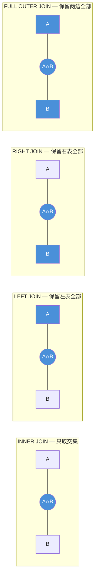
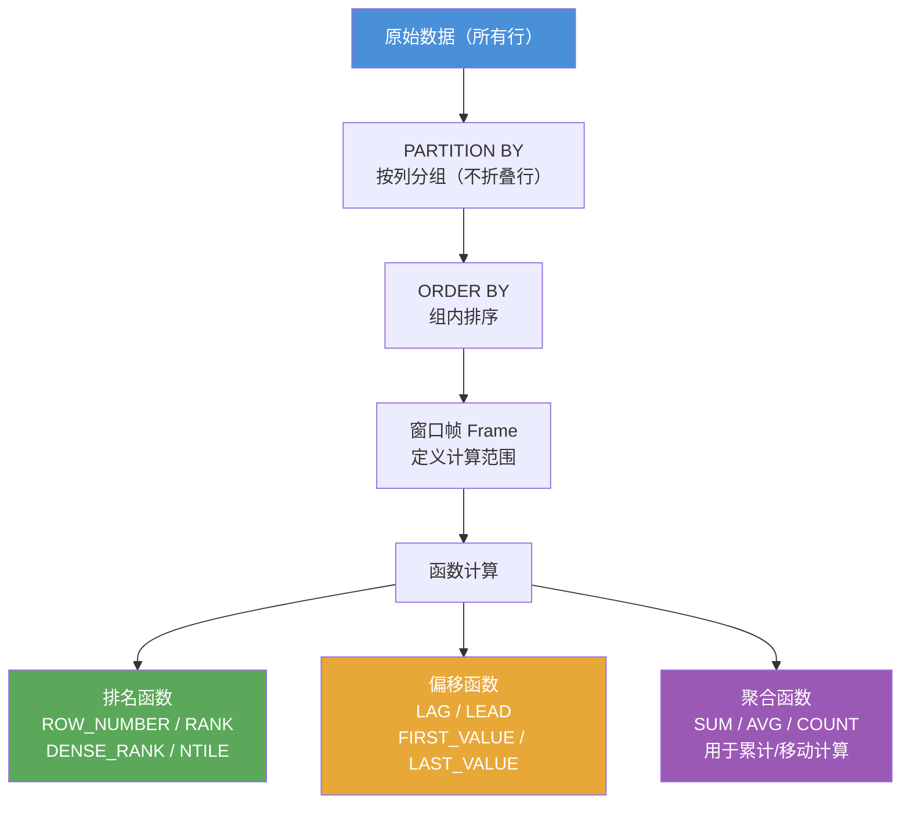

# PostgreSQL 高级查询

[TOC]

## JOIN 类型速查



| JOIN 类型 | 说明 | MySQL 支持 |
|-----------|------|-----------|
| `INNER JOIN` | 两边都有才返回 | ✅ |
| `LEFT JOIN` | 左表全返回，右表没有补 NULL | ✅ |
| `RIGHT JOIN` | 右表全返回，左表没有补 NULL | ✅ |
| `FULL OUTER JOIN` | 两边都全返回 | ❌ 需模拟 |
| `CROSS JOIN` | 笛卡尔积 | ✅ |

## JOIN 联结

```sql
-- INNER JOIN（内联结）：查询每首曲目及其所属专辑和艺术家
SELECT ar.name AS artist_name, al.title AS album_title, t.name AS track_name, t.unit_price
FROM artist AS ar
INNER JOIN album AS al ON ar.artist_id = al.artist_id
INNER JOIN track AS t  ON al.album_id  = t.album_id
ORDER BY ar.name, al.title, t.name;

-- LEFT JOIN（左外联结）：列出所有客户，包括没有任何订单的客户
SELECT c.customer_id, c.first_name, c.last_name, i.invoice_id
FROM customer AS c
LEFT JOIN invoice AS i ON c.customer_id = i.customer_id;

-- RIGHT JOIN（右外联结）：以发票为主，列出对应客户（逻辑上与 LEFT JOIN 互换）
SELECT i.invoice_id, c.first_name, c.last_name
FROM invoice AS i
RIGHT JOIN customer AS c ON i.customer_id = c.customer_id;

-- FULL OUTER JOIN（全外联结）：保留两边所有行
SELECT c.first_name, c.last_name, i.invoice_id
FROM customer AS c
FULL OUTER JOIN invoice AS i ON c.customer_id = i.customer_id;

-- CROSS JOIN（笛卡尔积）：所有流派与媒体类型的组合
SELECT g.name AS genre, m.name AS media_type
FROM genre CROSS JOIN media_type;

-- 自联结：找出与某首曲目同属同一专辑的其他曲目
-- 等价于"同一张专辑里还有哪些曲目"
SELECT t1.track_id, t1.name AS track_name
FROM track AS t1
JOIN track AS t2 ON t1.album_id = t2.album_id
WHERE t2.name = 'For Those About To Rock (We Salute You)'
  AND t1.name <> t2.name;

-- 多表联结：查找购买过特定曲目的所有客户
SELECT DISTINCT c.first_name, c.last_name, c.email
FROM customer AS c
JOIN invoice     AS i  ON c.customer_id  = i.customer_id
JOIN invoice_line AS il ON i.invoice_id   = il.invoice_id
JOIN track        AS t  ON il.track_id    = t.track_id
WHERE t.name = 'Balls to the Wall';
```

## 子查询

```sql
-- WHERE 子查询：查找购买过 "Balls to the Wall" 的客户
SELECT first_name, last_name, email
FROM customer
WHERE customer_id IN (
    SELECT customer_id FROM invoice
    WHERE invoice_id IN (
        SELECT invoice_id FROM invoice_line
        WHERE track_id = (
            SELECT track_id FROM track WHERE name = 'Balls to the Wall'
        )
    )
);

-- 相关子查询（Correlated Subquery）：显示每位客户的姓名及其发票数量
SELECT first_name, last_name,
    (SELECT COUNT(*) FROM invoice WHERE invoice.customer_id = customer.customer_id) AS invoice_count
FROM customer
ORDER BY last_name, first_name;

-- EXISTS / NOT EXISTS（通常比 IN 更高效）
-- 查找有过购买记录的客户
SELECT first_name, last_name FROM customer AS c
WHERE EXISTS (
    SELECT 1 FROM invoice AS i WHERE i.customer_id = c.customer_id
);

-- 查找从未购买过的客户
SELECT first_name, last_name FROM customer AS c
WHERE NOT EXISTS (
    SELECT 1 FROM invoice AS i WHERE i.customer_id = c.customer_id
);

-- FROM 子查询（派生表）：查找平均曲目单价高于 $1 的流派
SELECT avg_data.genre_id, avg_data.avg_price
FROM (
    SELECT genre_id, AVG(unit_price) AS avg_price
    FROM track
    GROUP BY genre_id
) AS avg_data
WHERE avg_data.avg_price > 1;
```

## CTE（公用表表达式，WITH 子句）

CTE 是 PostgreSQL 的重要特性，比子查询更易读，且可以复用。

```sql
-- 基本 CTE：计算每张发票的总金额，再关联客户信息
WITH invoice_totals AS (
    SELECT invoice_id, SUM(unit_price * quantity) AS total
    FROM invoice_line
    GROUP BY invoice_id
)
SELECT i.invoice_id, c.first_name, c.last_name, it.total
FROM invoice AS i
JOIN customer      AS c  ON i.customer_id  = c.customer_id
JOIN invoice_totals AS it ON i.invoice_id   = it.invoice_id
ORDER BY it.total DESC;

-- 多个 CTE：先筛出高价值发票，再关联客户与日期
WITH
high_value_invoices AS (
    SELECT invoice_id, SUM(unit_price * quantity) AS total
    FROM invoice_line
    GROUP BY invoice_id
    HAVING SUM(unit_price * quantity) >= 10
),
invoice_customers AS (
    SELECT i.invoice_id, c.first_name, c.last_name, i.invoice_date
    FROM invoice AS i
    JOIN customer AS c ON i.customer_id = c.customer_id
)
SELECT ic.first_name, ic.last_name, ic.invoice_date, hvi.total
FROM high_value_invoices AS hvi
JOIN invoice_customers AS ic ON hvi.invoice_id = ic.invoice_id;

-- 递归 CTE（用于树形/层级数据）
-- Chinook 的 employee 表自带 reports_to 字段，直接使用即可
WITH RECURSIVE emp_hierarchy AS (
    -- 锚点：找到根节点（没有上级的员工）
    SELECT employee_id,
           first_name || ' ' || last_name AS emp_name,
           reports_to,
           0 AS level,
           (first_name || ' ' || last_name)::TEXT AS path
    FROM employee
    WHERE reports_to IS NULL

    UNION ALL

    -- 递归部分：逐层向下查找下属
    SELECT e.employee_id,
           e.first_name || ' ' || e.last_name,
           e.reports_to,
           eh.level + 1,
           eh.path || ' > ' || e.first_name || ' ' || e.last_name
    FROM employee AS e
    JOIN emp_hierarchy AS eh ON e.reports_to = eh.employee_id
)
SELECT level, path FROM emp_hierarchy ORDER BY path;
```

## 窗口函数（Window Functions）

窗口函数是 PostgreSQL 的强大特性，可以在不折叠行的情况下进行聚合计算。



**与 GROUP BY 的关键区别**：GROUP BY 会折叠行（多行变一行），窗口函数不折叠，每行都保留并附加计算结果。

```sql
-- 基本语法：函数() OVER (PARTITION BY ... ORDER BY ...)

-- ROW_NUMBER：所有曲目按单价从高到低排序，每行唯一序号
SELECT name, unit_price,
    ROW_NUMBER() OVER (ORDER BY unit_price DESC) AS price_rank
FROM track;

-- RANK：有并列时跳号（1,1,3）
-- DENSE_RANK：有并列时不跳号（1,1,2）
-- 按流派分组，在组内对曲目单价排名
SELECT t.name, g.name AS genre, t.unit_price,
    RANK()       OVER (PARTITION BY t.genre_id ORDER BY t.unit_price DESC) AS rank_in_genre,
    DENSE_RANK() OVER (ORDER BY t.unit_price DESC)                         AS overall_rank
FROM track AS t
JOIN genre AS g ON t.genre_id = g.genre_id;

-- NTILE(n)：将所有曲目按时长分为 4 个四分位组
SELECT name, milliseconds,
    NTILE(4) OVER (ORDER BY milliseconds) AS duration_quartile
FROM track;

-- LAG / LEAD：访问前/后 N 行的值
-- 显示每张发票的日期，以及前一张和后一张发票的日期
SELECT invoice_id, invoice_date,
    LAG(invoice_date, 1)  OVER (ORDER BY invoice_date) AS prev_invoice_date,
    LEAD(invoice_date, 1) OVER (ORDER BY invoice_date) AS next_invoice_date
FROM invoice;

-- FIRST_VALUE / LAST_VALUE / NTH_VALUE
-- 每个流派中，同时显示当前曲目、最便宜和最贵的曲目名称
SELECT t.name AS track_name, g.name AS genre, t.unit_price,
    FIRST_VALUE(t.name) OVER (PARTITION BY t.genre_id ORDER BY t.unit_price) AS cheapest_in_genre,
    LAST_VALUE(t.name) OVER (
        PARTITION BY t.genre_id
        ORDER BY t.unit_price
        ROWS BETWEEN UNBOUNDED PRECEDING AND UNBOUNDED FOLLOWING
    ) AS most_expensive_in_genre
FROM track AS t
JOIN genre AS g ON t.genre_id = g.genre_id;

-- 聚合窗口函数（不折叠行）：每行保留明细，同时显示所在发票的汇总信息
SELECT il.invoice_id, t.name AS track_name, il.unit_price, il.quantity,
    SUM(il.unit_price * il.quantity) OVER (PARTITION BY il.invoice_id) AS invoice_total,
    AVG(il.unit_price)               OVER (PARTITION BY il.invoice_id) AS avg_track_price,
    COUNT(*)                         OVER (PARTITION BY il.invoice_id) AS tracks_in_invoice
FROM invoice_line AS il
JOIN track AS t ON il.track_id = t.track_id;

-- 累计求和（Running Total）：按日期累计发票总金额
SELECT invoice_id, invoice_date, total,
    SUM(total) OVER (ORDER BY invoice_date ROWS UNBOUNDED PRECEDING) AS running_total
FROM invoice;

-- 移动平均（3 行移动平均）：每日销售额的 3 日移动均值
SELECT sale_date, daily_total,
    AVG(daily_total) OVER (
        ORDER BY sale_date
        ROWS BETWEEN 2 PRECEDING AND CURRENT ROW
    ) AS moving_avg_3
FROM (
    SELECT invoice_date::DATE AS sale_date,
           SUM(total)         AS daily_total
    FROM invoice
    GROUP BY invoice_date::DATE
) AS daily_sales;
```

## DISTINCT ON（PostgreSQL 特有）

```sql
-- 取每个流派中单价最低的曲目（比 GROUP BY + MIN 更灵活，可同时取其他列）
SELECT DISTINCT ON (genre_id)
    genre_id, name AS track_name, unit_price
FROM track
ORDER BY genre_id, unit_price ASC;

-- DISTINCT ON 后的列必须是 ORDER BY 的第一个列
```

## LATERAL 子查询

```sql
-- LATERAL 允许子查询引用前面表的列（类似于 correlated subquery 在 FROM 中使用）
-- 查询每位客户最近的 2 张发票
SELECT c.first_name, c.last_name, recent.invoice_id, recent.invoice_date, recent.total
FROM customer AS c
JOIN LATERAL (
    SELECT invoice_id, invoice_date, total
    FROM invoice
    WHERE invoice.customer_id = c.customer_id
    ORDER BY invoice_date DESC
    LIMIT 2
) AS recent ON TRUE;
```

## 全文搜索

```sql
-- PostgreSQL 内置全文搜索，使用 tsvector 和 tsquery

-- 创建带全文搜索的表
CREATE TABLE articles (
    id      SERIAL PRIMARY KEY,
    title   TEXT,
    body    TEXT,
    search_vector TSVECTOR
        GENERATED ALWAYS AS (
            to_tsvector('english', COALESCE(title, '') || ' ' || COALESCE(body, ''))
        ) STORED
);

-- 创建 GIN 索引加速全文搜索
CREATE INDEX idx_articles_search ON articles USING GIN (search_vector);

-- 查询
SELECT title FROM articles
WHERE search_vector @@ to_tsquery('english', 'database & performance');

-- 关键词高亮
SELECT title, ts_headline('english', body, to_tsquery('database & performance'),
    'StartSel=<b>, StopSel=</b>, MaxWords=50')
FROM articles
WHERE search_vector @@ to_tsquery('english', 'database & performance');

-- 排名
SELECT title, ts_rank(search_vector, to_tsquery('database')) AS rank
FROM articles
WHERE search_vector @@ to_tsquery('database')
ORDER BY rank DESC;

-- 简单即席全文搜索（不建立 tsvector 列）
SELECT title FROM articles
WHERE to_tsvector('english', title || ' ' || body) @@ to_tsquery('english', 'database');
```
