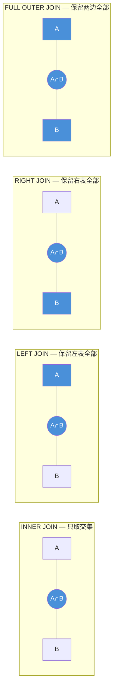
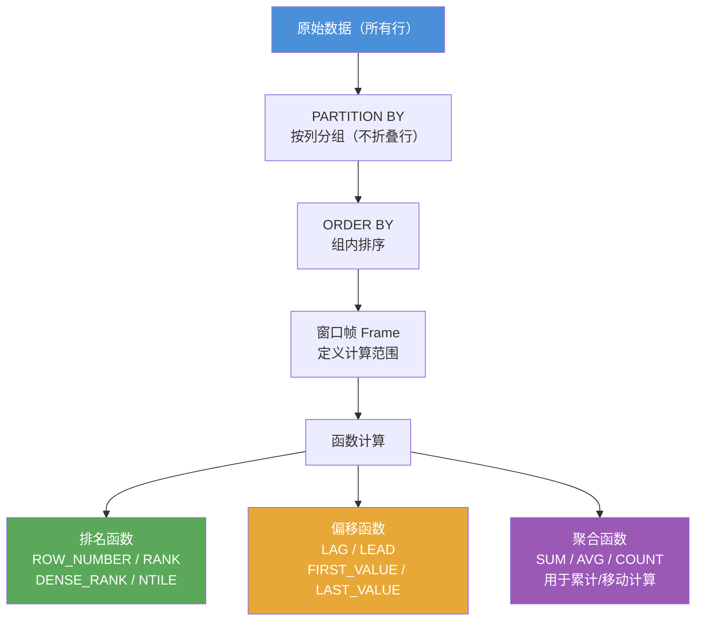

# PostgreSQL 高级查询

[TOC]

## JOIN 类型速查



| JOIN 类型 | 说明 | MySQL 支持 |
|-----------|------|-----------|
| `INNER JOIN` | 两边都有才返回 | ✅ |
| `LEFT JOIN` | 左表全返回，右表没有补 NULL | ✅ |
| `RIGHT JOIN` | 右表全返回，左表没有补 NULL | ✅ |
| `FULL OUTER JOIN` | 两边都全返回 | ❌ 需模拟 |
| `CROSS JOIN` | 笛卡尔积 | ✅ |

## JOIN 联结

```sql
-- INNER JOIN（内联结，与 MySQL 相同）
SELECT v.vend_name, p.prod_name, p.prod_price
FROM vendors AS v
INNER JOIN products AS p ON v.vend_id = p.vend_id
ORDER BY v.vend_name, p.prod_name;

-- LEFT JOIN（左外联结）
SELECT c.cust_id, c.cust_name, o.order_num
FROM customers AS c
LEFT JOIN orders AS o ON c.cust_id = o.cust_id;

-- RIGHT JOIN（右外联结）
SELECT o.order_num, c.cust_name
FROM orders AS o
RIGHT JOIN customers AS c ON o.cust_id = c.cust_id;

-- FULL OUTER JOIN（全外联结，MySQL 不原生支持）
SELECT c.cust_name, o.order_num
FROM customers AS c
FULL OUTER JOIN orders AS o ON c.cust_id = o.cust_id;

-- CROSS JOIN（笛卡尔积）
SELECT * FROM products CROSS JOIN vendors;

-- 自联结
SELECT p1.prod_id, p1.prod_name
FROM products AS p1
JOIN products AS p2 ON p1.vend_id = p2.vend_id
WHERE p2.prod_id = 'DTNTR';

-- 多表联结
SELECT c.cust_name, c.cust_contact
FROM customers AS c
JOIN orders AS o ON c.cust_id = o.cust_id
JOIN orderitems AS oi ON o.order_num = oi.order_num
WHERE oi.prod_id = 'TNT2';
```

## 子查询

```sql
-- WHERE 子查询
SELECT cust_name, cust_contact
FROM customers
WHERE cust_id IN (
    SELECT cust_id FROM orders
    WHERE order_num IN (
        SELECT order_num FROM orderitems WHERE prod_id = 'TNT2'
    )
);

-- 相关子查询（Correlated Subquery）
SELECT cust_name, cust_state,
    (SELECT COUNT(*) FROM orders WHERE orders.cust_id = customers.cust_id) AS order_count
FROM customers
ORDER BY cust_name;

-- EXISTS / NOT EXISTS（通常比 IN 更高效）
SELECT cust_name FROM customers c
WHERE EXISTS (
    SELECT 1 FROM orders o WHERE o.cust_id = c.cust_id
);

SELECT cust_name FROM customers c
WHERE NOT EXISTS (
    SELECT 1 FROM orders o WHERE o.cust_id = c.cust_id
);

-- FROM 子查询（派生表）
SELECT avg_data.vend_id, avg_data.avg_price
FROM (
    SELECT vend_id, AVG(prod_price) AS avg_price
    FROM products
    GROUP BY vend_id
) AS avg_data
WHERE avg_data.avg_price > 10;
```

## CTE（公用表表达式，WITH 子句）

CTE 是 PostgreSQL 的重要特性，比子查询更易读，且可以复用。

```sql
-- 基本 CTE
WITH order_totals AS (
    SELECT order_num, SUM(item_price * quantity) AS total
    FROM orderitems
    GROUP BY order_num
)
SELECT o.order_num, c.cust_name, ot.total
FROM orders AS o
JOIN customers AS c ON o.cust_id = c.cust_id
JOIN order_totals AS ot ON o.order_num = ot.order_num
ORDER BY ot.total DESC;

-- 多个 CTE
WITH
high_value_orders AS (
    SELECT order_num, SUM(item_price * quantity) AS total
    FROM orderitems
    GROUP BY order_num
    HAVING SUM(item_price * quantity) >= 100
),
order_customers AS (
    SELECT o.order_num, c.cust_name, o.order_date
    FROM orders AS o
    JOIN customers AS c ON o.cust_id = c.cust_id
)
SELECT oc.cust_name, oc.order_date, hvo.total
FROM high_value_orders AS hvo
JOIN order_customers AS oc ON hvo.order_num = oc.order_num;

-- 递归 CTE（用于树形/层级数据）
-- 例：员工层级结构
CREATE TABLE employees (
    emp_id   INTEGER PRIMARY KEY,
    emp_name TEXT NOT NULL,
    manager_id INTEGER REFERENCES employees(emp_id)
);

WITH RECURSIVE emp_hierarchy AS (
    -- 锚点：找到根节点（没有上级）
    SELECT emp_id, emp_name, manager_id, 0 AS level, emp_name::TEXT AS path
    FROM employees
    WHERE manager_id IS NULL

    UNION ALL

    -- 递归部分：逐层向下查找
    SELECT e.emp_id, e.emp_name, e.manager_id, eh.level + 1,
           eh.path || ' > ' || e.emp_name
    FROM employees AS e
    JOIN emp_hierarchy AS eh ON e.manager_id = eh.emp_id
)
SELECT level, path FROM emp_hierarchy ORDER BY path;
```

## 窗口函数（Window Functions）

窗口函数是 PostgreSQL 的强大特性，可以在不折叠行的情况下进行聚合计算。



**与 GROUP BY 的关键区别**：GROUP BY 会折叠行（多行变一行），窗口函数不折叠，每行都保留并附加计算结果。

```sql
-- 基本语法：函数() OVER (PARTITION BY ... ORDER BY ...)

-- ROW_NUMBER：每行唯一序号
SELECT prod_name, prod_price,
    ROW_NUMBER() OVER (ORDER BY prod_price DESC) AS price_rank
FROM products;

-- RANK：有并列时跳号（1,1,3）
-- DENSE_RANK：有并列时不跳号（1,1,2）
SELECT prod_name, vend_id, prod_price,
    RANK() OVER (PARTITION BY vend_id ORDER BY prod_price DESC) AS rank_in_vendor,
    DENSE_RANK() OVER (ORDER BY prod_price DESC) AS overall_rank
FROM products;

-- NTILE(n)：将结果分为 n 组（百分位、四分位等）
SELECT prod_name, prod_price,
    NTILE(4) OVER (ORDER BY prod_price) AS quartile
FROM products;

-- LAG / LEAD：访问前/后 N 行的值
SELECT order_num, order_date,
    LAG(order_date, 1) OVER (ORDER BY order_date) AS prev_date,
    LEAD(order_date, 1) OVER (ORDER BY order_date) AS next_date
FROM orders;

-- FIRST_VALUE / LAST_VALUE / NTH_VALUE
SELECT prod_name, vend_id, prod_price,
    FIRST_VALUE(prod_name) OVER (PARTITION BY vend_id ORDER BY prod_price) AS cheapest,
    LAST_VALUE(prod_name) OVER (
        PARTITION BY vend_id
        ORDER BY prod_price
        ROWS BETWEEN UNBOUNDED PRECEDING AND UNBOUNDED FOLLOWING
    ) AS most_expensive
FROM products;

-- 聚合窗口函数（不折叠行）
SELECT order_num, item_price, quantity,
    SUM(item_price * quantity) OVER (PARTITION BY order_num) AS order_total,
    AVG(item_price) OVER (PARTITION BY order_num) AS avg_item_price,
    COUNT(*) OVER (PARTITION BY order_num) AS items_in_order
FROM orderitems;

-- 累计求和（Running Total）
SELECT order_num, order_date,
    SUM(total) OVER (ORDER BY order_date ROWS UNBOUNDED PRECEDING) AS running_total
FROM (
    SELECT o.order_num, o.order_date, SUM(oi.item_price * oi.quantity) AS total
    FROM orders AS o
    JOIN orderitems AS oi ON o.order_num = oi.order_num
    GROUP BY o.order_num, o.order_date
) AS order_totals;

-- 移动平均（3行移动平均）
SELECT order_date, total,
    AVG(total) OVER (
        ORDER BY order_date
        ROWS BETWEEN 2 PRECEDING AND CURRENT ROW
    ) AS moving_avg_3
FROM (
    SELECT order_date, SUM(item_price * quantity) AS total
    FROM orders JOIN orderitems USING (order_num)
    GROUP BY order_date
) AS daily_totals;
```

## DISTINCT ON（PostgreSQL 特有）

```sql
-- 取每个 vend_id 中价格最低的产品（比 GROUP BY + MIN 更灵活）
SELECT DISTINCT ON (vend_id)
    vend_id, prod_name, prod_price
FROM products
ORDER BY vend_id, prod_price ASC;

-- DISTINCT ON 后的列必须是 ORDER BY 的第一个列
```

## LATERAL 子查询

```sql
-- LATERAL 允许子查询引用前面表的列（类似于 correlated subquery 在 FROM 中使用）
SELECT c.cust_name, recent.order_num, recent.order_date
FROM customers AS c
JOIN LATERAL (
    SELECT order_num, order_date
    FROM orders
    WHERE orders.cust_id = c.cust_id
    ORDER BY order_date DESC
    LIMIT 2
) AS recent ON TRUE;
```

## 全文搜索

```sql
-- PostgreSQL 内置全文搜索，使用 tsvector 和 tsquery

-- 创建带全文搜索的表
CREATE TABLE articles (
    id      SERIAL PRIMARY KEY,
    title   TEXT,
    body    TEXT,
    search_vector TSVECTOR
        GENERATED ALWAYS AS (
            to_tsvector('english', COALESCE(title, '') || ' ' || COALESCE(body, ''))
        ) STORED
);

-- 创建 GIN 索引加速全文搜索
CREATE INDEX idx_articles_search ON articles USING GIN (search_vector);

-- 查询
SELECT title FROM articles
WHERE search_vector @@ to_tsquery('english', 'database & performance');

-- 关键词高亮
SELECT title, ts_headline('english', body, to_tsquery('database & performance'),
    'StartSel=<b>, StopSel=</b>, MaxWords=50')
FROM articles
WHERE search_vector @@ to_tsquery('english', 'database & performance');

-- 排名
SELECT title, ts_rank(search_vector, to_tsquery('database')) AS rank
FROM articles
WHERE search_vector @@ to_tsquery('database')
ORDER BY rank DESC;

-- 简单即席全文搜索（不建立 tsvector 列）
SELECT title FROM articles
WHERE to_tsvector('english', title || ' ' || body) @@ to_tsquery('english', 'database');
```
