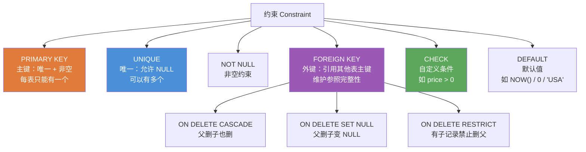

# PostgreSQL DDL — 表操作

[TOC]

## 约束类型速查



## 创建表

```sql
-- 基本建表
CREATE TABLE customers (
    cust_id      SERIAL PRIMARY KEY,
    cust_name    VARCHAR(100) NOT NULL,
    cust_address TEXT,
    cust_city    VARCHAR(50),
    cust_state   CHAR(5),
    cust_zip     VARCHAR(10),
    cust_country VARCHAR(50) DEFAULT 'USA',
    cust_contact VARCHAR(50),
    cust_email   VARCHAR(255)
);

-- IF NOT EXISTS
CREATE TABLE IF NOT EXISTS customers (
    cust_id SERIAL PRIMARY KEY,
    cust_name TEXT NOT NULL
);

-- 完整示例（对应原书表结构，使用 PostgreSQL 语法）
CREATE TABLE vendors (
    vend_id      SERIAL PRIMARY KEY,
    vend_name    VARCHAR(50) NOT NULL,
    vend_address VARCHAR(50),
    vend_city    VARCHAR(50),
    vend_state   CHAR(5),
    vend_zip     VARCHAR(10),
    vend_country VARCHAR(50)
);

CREATE TABLE products (
    prod_id    CHAR(10) PRIMARY KEY,
    vend_id    INTEGER NOT NULL REFERENCES vendors(vend_id),  -- 外键
    prod_name  VARCHAR(255) NOT NULL,
    prod_price NUMERIC(8, 2) NOT NULL,
    prod_desc  TEXT,
    CONSTRAINT chk_prod_price CHECK (prod_price > 0)         -- CHECK 约束
);

CREATE TABLE orders (
    order_num  SERIAL PRIMARY KEY,
    order_date TIMESTAMPTZ NOT NULL DEFAULT NOW(),
    cust_id    INTEGER NOT NULL REFERENCES customers(cust_id)
);

CREATE TABLE orderitems (
    order_num  INTEGER NOT NULL REFERENCES orders(order_num),
    order_item INTEGER NOT NULL,
    prod_id    CHAR(10) NOT NULL REFERENCES products(prod_id),
    quantity   INTEGER NOT NULL DEFAULT 1,
    item_price NUMERIC(8, 2) NOT NULL,
    PRIMARY KEY (order_num, order_item),                     -- 组合主键
    CONSTRAINT chk_quantity CHECK (quantity > 0)
);
```

## 主键与约束

```sql
-- 单列主键（三种等效写法）
id SERIAL PRIMARY KEY,
-- 或
id SERIAL, PRIMARY KEY (id)
-- 或
ALTER TABLE mytable ADD PRIMARY KEY (id);

-- 组合主键
PRIMARY KEY (order_num, order_item)

-- UNIQUE 约束
CREATE TABLE users (
    id       SERIAL PRIMARY KEY,
    email    VARCHAR(255) UNIQUE,
    username VARCHAR(50) NOT NULL,
    UNIQUE (username)               -- 等效写法
);

-- NOT NULL
col_name TEXT NOT NULL

-- DEFAULT
col_name INTEGER NOT NULL DEFAULT 0
created_at TIMESTAMPTZ NOT NULL DEFAULT NOW()

-- CHECK 约束
CONSTRAINT chk_price CHECK (price > 0),
CONSTRAINT chk_email CHECK (email LIKE '%@%')

-- 外键
FOREIGN KEY (cust_id) REFERENCES customers(cust_id),
-- 简写
cust_id INTEGER REFERENCES customers(cust_id)

-- 外键级联操作
cust_id INTEGER REFERENCES customers(cust_id)
    ON DELETE CASCADE      -- 删除父记录时级联删除子记录
    ON UPDATE CASCADE      -- 更新父键时级联更新
    -- ON DELETE SET NULL  -- 删除父记录时将外键设为 NULL
    -- ON DELETE RESTRICT  -- 有子记录时禁止删除父记录（默认）
```

## SEQUENCE（序列）

```sql
-- SERIAL 等同于自动创建序列，手动创建序列更灵活
CREATE SEQUENCE order_num_seq
    START WITH 20001
    INCREMENT BY 1
    MINVALUE 20001
    NO MAXVALUE
    CACHE 1;

CREATE TABLE orders (
    order_num INTEGER PRIMARY KEY DEFAULT nextval('order_num_seq'),
    order_date TIMESTAMPTZ NOT NULL DEFAULT NOW()
);

-- 序列操作
SELECT nextval('order_num_seq');     -- 取下一个值（会自增）
SELECT currval('order_num_seq');     -- 取当前值（不自增）
SELECT lastval();                    -- 取本会话最近使用的序列值
SELECT setval('order_num_seq', 30000);  -- 设置序列值

-- 查看序列信息
SELECT * FROM information_schema.sequences;
```

## ALTER TABLE 修改表

```sql
-- 添加列
ALTER TABLE vendors ADD COLUMN vend_phone VARCHAR(20);
ALTER TABLE vendors ADD COLUMN created_at TIMESTAMPTZ DEFAULT NOW();

-- 删除列
ALTER TABLE vendors DROP COLUMN vend_phone;
ALTER TABLE vendors DROP COLUMN IF EXISTS vend_phone;
ALTER TABLE vendors DROP COLUMN vend_phone CASCADE;  -- 同时删除依赖此列的视图等

-- 修改列类型
ALTER TABLE products ALTER COLUMN prod_price TYPE NUMERIC(10, 2);
-- 带转换函数
ALTER TABLE products ALTER COLUMN prod_id TYPE INTEGER USING prod_id::INTEGER;

-- 重命名列
ALTER TABLE vendors RENAME COLUMN vend_zip TO postal_code;

-- 设置/删除默认值
ALTER TABLE customers ALTER COLUMN cust_country SET DEFAULT 'USA';
ALTER TABLE customers ALTER COLUMN cust_country DROP DEFAULT;

-- 设置/删除 NOT NULL
ALTER TABLE customers ALTER COLUMN cust_name SET NOT NULL;
ALTER TABLE customers ALTER COLUMN cust_address DROP NOT NULL;

-- 添加约束
ALTER TABLE products ADD CONSTRAINT chk_price CHECK (prod_price > 0);
ALTER TABLE products ADD CONSTRAINT uq_prod_name UNIQUE (prod_name);
ALTER TABLE orderitems ADD FOREIGN KEY (prod_id) REFERENCES products(prod_id);

-- 删除约束
ALTER TABLE products DROP CONSTRAINT chk_price;
ALTER TABLE products DROP CONSTRAINT IF EXISTS chk_price;

-- 重命名表
ALTER TABLE customers RENAME TO clients;

-- 修改表的 schema
ALTER TABLE products SET SCHEMA myschema;
```

## 删除表

```sql
DROP TABLE customers;
DROP TABLE IF EXISTS customers;
DROP TABLE customers CASCADE;   -- 同时删除依赖此表的视图、外键等
DROP TABLE IF EXISTS customers, orders, orderitems;  -- 同时删除多张表
```

## 继承（TABLE INHERITANCE，PostgreSQL 特有）

```sql
-- 父表
CREATE TABLE shapes (
    id    SERIAL PRIMARY KEY,
    color TEXT
);

-- 子表继承父表的列
CREATE TABLE circles (
    radius NUMERIC
) INHERITS (shapes);

CREATE TABLE rectangles (
    width  NUMERIC,
    height NUMERIC
) INHERITS (shapes);

INSERT INTO circles(color, radius) VALUES ('red', 5.0);
INSERT INTO rectangles(color, width, height) VALUES ('blue', 3.0, 4.0);

-- 查询父表会包含所有子表的行
SELECT * FROM shapes;           -- 包含 circles 和 rectangles 的行
SELECT * FROM ONLY shapes;      -- 只查父表本身的行
```

## 分区表（Table Partitioning）

```sql
-- 范围分区（按时间分区是常见场景）
CREATE TABLE orders_partitioned (
    order_num  INTEGER NOT NULL,
    order_date TIMESTAMPTZ NOT NULL,
    cust_id    INTEGER NOT NULL
) PARTITION BY RANGE (order_date);

-- 创建分区
CREATE TABLE orders_2023 PARTITION OF orders_partitioned
    FOR VALUES FROM ('2023-01-01') TO ('2024-01-01');

CREATE TABLE orders_2024 PARTITION OF orders_partitioned
    FOR VALUES FROM ('2024-01-01') TO ('2025-01-01');

CREATE TABLE orders_2025 PARTITION OF orders_partitioned
    FOR VALUES FROM ('2025-01-01') TO ('2026-01-01');

-- 列表分区
CREATE TABLE products_partitioned (
    prod_id   TEXT NOT NULL,
    region    TEXT NOT NULL,
    prod_name TEXT
) PARTITION BY LIST (region);

CREATE TABLE products_usa PARTITION OF products_partitioned
    FOR VALUES IN ('USA', 'Canada');

CREATE TABLE products_europe PARTITION OF products_partitioned
    FOR VALUES IN ('UK', 'France', 'Germany');

-- 哈希分区
CREATE TABLE logs_partitioned (
    log_id   INTEGER NOT NULL,
    log_data TEXT
) PARTITION BY HASH (log_id);

CREATE TABLE logs_p0 PARTITION OF logs_partitioned FOR VALUES WITH (MODULUS 4, REMAINDER 0);
CREATE TABLE logs_p1 PARTITION OF logs_partitioned FOR VALUES WITH (MODULUS 4, REMAINDER 1);
CREATE TABLE logs_p2 PARTITION OF logs_partitioned FOR VALUES WITH (MODULUS 4, REMAINDER 2);
CREATE TABLE logs_p3 PARTITION OF logs_partitioned FOR VALUES WITH (MODULUS 4, REMAINDER 3);
```

## 临时表

```sql
-- 会话级临时表（会话结束自动删除）
CREATE TEMP TABLE temp_results (
    id    INTEGER,
    value TEXT
);

-- 事务级临时表（事务结束自动删除）
CREATE TEMP TABLE temp_results (
    id    INTEGER,
    value TEXT
) ON COMMIT DELETE ROWS;

-- 使用临时表
INSERT INTO temp_results SELECT cust_id, cust_name FROM customers WHERE ...;
SELECT * FROM temp_results;
```

## COPY 批量导入导出

```sql
-- 导出到文件（服务器端）
COPY products TO '/tmp/products.csv' WITH (FORMAT CSV, HEADER);

-- 从文件导入（服务器端）
COPY products FROM '/tmp/products.csv' WITH (FORMAT CSV, HEADER);

-- 客户端 \copy（psql 命令，读取本地文件）
\copy products TO 'C:/data/products.csv' WITH (FORMAT CSV, HEADER)
\copy products FROM 'C:/data/products.csv' WITH (FORMAT CSV, HEADER)

-- 指定分隔符
COPY products TO '/tmp/products.tsv' WITH (FORMAT TEXT, DELIMITER E'\t');

-- 只导出特定列
COPY (SELECT prod_id, prod_name, prod_price FROM products) TO '/tmp/out.csv' WITH (FORMAT CSV);
```
