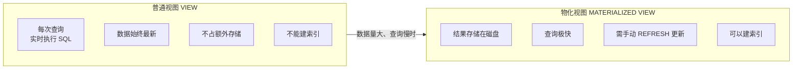
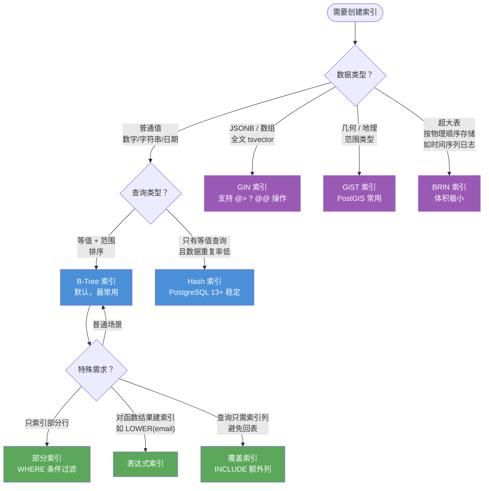

# PostgreSQL 视图与索引

[TOC]

## 视图类型对比



| | 普通视图 | 物化视图 |
|--|---------|---------|
| 数据新鲜度 | 实时 | 需手动刷新 |
| 查询速度 | 取决于底层查询 | 快（直接读存储） |
| 磁盘占用 | 无 | 有 |
| 可建索引 | 否 | 是 |
| MySQL 支持 | ✅ | ❌ |

## 视图

### 创建与使用视图

```sql
-- 创建视图
CREATE VIEW productcustomers AS
SELECT c.cust_name, c.cust_contact, oi.prod_id
FROM customers AS c
JOIN orders AS o ON c.cust_id = o.cust_id
JOIN orderitems AS oi ON o.order_num = oi.order_num;

-- 使用视图
SELECT cust_name, cust_contact FROM productcustomers WHERE prod_id = 'TNT2';

-- 创建或替换视图（不需要先 DROP）
CREATE OR REPLACE VIEW vendorlocations AS
SELECT TRIM(vend_name) || ' (' || TRIM(vend_country) || ')' AS vend_title
FROM vendors
ORDER BY vend_name;

-- 查看视图定义
\d+ productcustomers          -- psql 命令
SELECT definition FROM pg_views WHERE viewname = 'productcustomers';

-- 删除视图
DROP VIEW productcustomers;
DROP VIEW IF EXISTS productcustomers;
DROP VIEW productcustomers CASCADE;  -- 同时删除依赖此视图的视图
```

### 物化视图（Materialized View）

物化视图将查询结果存储在磁盘上，查询性能远高于普通视图，但数据需要手动刷新。

```sql
-- 创建物化视图
CREATE MATERIALIZED VIEW order_summary AS
SELECT
    c.cust_id,
    c.cust_name,
    COUNT(o.order_num) AS order_count,
    SUM(oi.item_price * oi.quantity) AS total_spent
FROM customers AS c
LEFT JOIN orders AS o ON c.cust_id = o.cust_id
LEFT JOIN orderitems AS oi ON o.order_num = oi.order_num
GROUP BY c.cust_id, c.cust_name
WITH DATA;  -- WITH DATA 立即填充数据，WITH NO DATA 创建空视图

-- 刷新物化视图（同步最新数据）
REFRESH MATERIALIZED VIEW order_summary;

-- 并发刷新（不锁表，需要唯一索引）
REFRESH MATERIALIZED VIEW CONCURRENTLY order_summary;

-- 在物化视图上创建索引
CREATE UNIQUE INDEX idx_order_summary_cust ON order_summary (cust_id);
CREATE INDEX idx_order_summary_total ON order_summary (total_spent DESC);

-- 删除物化视图
DROP MATERIALIZED VIEW order_summary;
```

### 可更新视图

```sql
-- 简单视图（单表，无聚合）默认可更新
CREATE VIEW active_customers AS
SELECT cust_id, cust_name, cust_email
FROM customers
WHERE cust_email IS NOT NULL;

-- 通过视图插入/更新/删除（会作用到底层表）
UPDATE active_customers SET cust_name = 'New Name' WHERE cust_id = 10001;
INSERT INTO active_customers(cust_name, cust_email) VALUES ('Test', 'test@test.com');

-- WITH CHECK OPTION：确保通过视图的 DML 操作仍满足视图条件
CREATE VIEW active_customers AS
SELECT cust_id, cust_name, cust_email
FROM customers
WHERE cust_email IS NOT NULL
WITH CHECK OPTION;  -- 通过此视图插入的行必须满足 cust_email IS NOT NULL

-- INSTEAD OF 触发器（让复杂视图可更新）
CREATE VIEW customer_orders AS
SELECT c.cust_name, o.order_num, o.order_date
FROM customers AS c JOIN orders AS o ON c.cust_id = o.cust_id;

CREATE OR REPLACE FUNCTION customer_orders_insert()
RETURNS TRIGGER AS $$
BEGIN
    INSERT INTO orders(order_date, cust_id)
    SELECT NEW.order_date, c.cust_id
    FROM customers AS c WHERE c.cust_name = NEW.cust_name;
    RETURN NEW;
END;
$$ LANGUAGE plpgsql;

CREATE TRIGGER trg_customer_orders_insert
INSTEAD OF INSERT ON customer_orders
FOR EACH ROW EXECUTE FUNCTION customer_orders_insert();
```

## 索引

### 索引类型选择决策树



### 索引类型概览

| 索引类型 | 适用场景 |
|----------|----------|
| `B-Tree` | 默认类型，适用于等值、范围、排序查询 |
| `Hash` | 只支持等值查询，PostgreSQL 13+ WAL 安全 |
| `GIN` | 全文搜索、数组、JSONB 包含查询 |
| `GiST` | 几何、全文搜索、范围类型、PostGIS |
| `SP-GiST` | 非平衡数据结构，IP 地址、电话号码前缀 |
| `BRIN` | 大表、按物理顺序存储的数据（时间序列） |

### 创建索引

```sql
-- 普通 B-Tree 索引（默认）
CREATE INDEX idx_products_vend ON products (vend_id);
CREATE INDEX IF NOT EXISTS idx_products_vend ON products (vend_id);

-- 唯一索引
CREATE UNIQUE INDEX idx_customers_email ON customers (cust_email);

-- 组合索引（多列）
CREATE INDEX idx_orders_date_cust ON orders (order_date, cust_id);

-- 降序索引
CREATE INDEX idx_products_price_desc ON products (prod_price DESC);

-- 部分索引（只索引满足条件的行，节省空间，加速特定查询）
CREATE INDEX idx_active_orders ON orders (order_date)
WHERE order_date >= '2024-01-01';

-- 表达式索引（对表达式或函数结果建索引）
CREATE INDEX idx_customers_email_lower ON customers (LOWER(cust_email));
-- 使用时也需用相同表达式：WHERE LOWER(cust_email) = 'test@test.com'

-- GIN 索引（全文搜索）
CREATE INDEX idx_articles_fts ON articles USING GIN (to_tsvector('english', body));

-- GIN 索引（JSONB）
CREATE INDEX idx_events_data ON events USING GIN (data);

-- GIN 索引（数组）
CREATE INDEX idx_products_tags ON products USING GIN (tags);

-- BRIN 索引（大时间序列表）
CREATE INDEX idx_logs_created ON logs USING BRIN (created_at);

-- 并发创建索引（不锁表，适合生产环境）
CREATE INDEX CONCURRENTLY idx_products_vend ON products (vend_id);
```

### 查看与管理索引

```sql
-- 查看表的索引
\di products                -- psql 命令
SELECT indexname, indexdef FROM pg_indexes WHERE tablename = 'products';

-- 查看索引使用情况
SELECT
    schemaname,
    tablename,
    indexname,
    idx_scan AS scans,
    idx_tup_read AS tuples_read,
    idx_tup_fetch AS tuples_fetched
FROM pg_stat_user_indexes
WHERE tablename = 'products';

-- 找出从未使用的索引（考虑删除以节省维护开销）
SELECT schemaname, tablename, indexname, idx_scan
FROM pg_stat_user_indexes
WHERE idx_scan = 0 AND indexname NOT LIKE '%_pkey';

-- 删除索引
DROP INDEX idx_products_vend;
DROP INDEX IF EXISTS idx_products_vend;
DROP INDEX CONCURRENTLY idx_products_vend;  -- 不锁表

-- 重建索引（整理碎片）
REINDEX INDEX idx_products_vend;
REINDEX TABLE products;             -- 重建表的所有索引
REINDEX DATABASE mydb;              -- 重建数据库所有索引
```

### EXPLAIN 分析查询计划

```sql
-- 查看查询计划（不实际执行）
EXPLAIN
SELECT c.cust_name, COUNT(o.order_num)
FROM customers AS c
LEFT JOIN orders AS o ON c.cust_id = o.cust_id
GROUP BY c.cust_id;

-- 查看实际执行情况（包含真实时间和行数）
EXPLAIN ANALYZE
SELECT * FROM products WHERE vend_id = 1001;

-- 更详细的输出
EXPLAIN (ANALYZE, BUFFERS, FORMAT JSON)
SELECT * FROM products WHERE vend_id = 1001;

-- 关键指标解读：
-- Seq Scan：全表扫描（没用到索引）
-- Index Scan：使用索引
-- Index Only Scan：只用索引，不访问表数据（最优）
-- Bitmap Index Scan：位图索引扫描（适合大量匹配行）
-- cost=0.00..8.27：估算代价（启动代价..总代价）
-- rows=196：预估返回行数
-- actual time=0.012..0.234：实际时间（毫秒）
-- actual rows=196：实际返回行数
```

### 索引使用技巧

```sql
-- 覆盖索引（Index Only Scan）：索引包含查询所需的所有列
CREATE INDEX idx_products_cover ON products (vend_id) INCLUDE (prod_name, prod_price);

-- 查询只需要 vend_id、prod_name、prod_price，不需要回表
SELECT vend_id, prod_name, prod_price FROM products WHERE vend_id = 1001;

-- 组合索引的列顺序很重要：选择性高的列放前面
-- (vend_id, prod_price) vs (prod_price, vend_id) — 若 WHERE vend_id = ? 更常用，则 vend_id 放前
CREATE INDEX idx_products_vend_price ON products (vend_id, prod_price);

-- 这个查询能用到上面的索引（前缀匹配）：
SELECT * FROM products WHERE vend_id = 1001;
SELECT * FROM products WHERE vend_id = 1001 AND prod_price > 5;
-- 这个用不到（跳过了第一列）：
SELECT * FROM products WHERE prod_price > 5;
```
