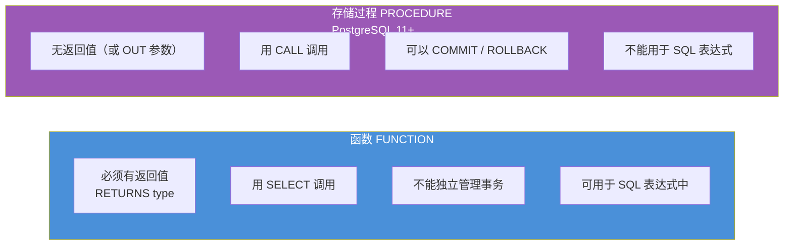
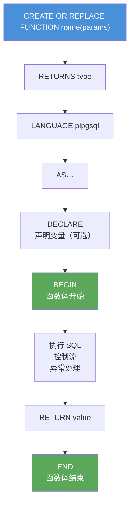

# PostgreSQL 函数与存储过程

PostgreSQL 使用 **PL/pgSQL** 作为主要的过程式语言，语法与 MySQL 的存储过程有较大差异。

[TOC]

## 函数 vs 存储过程



## PL/pgSQL 代码结构



## 创建函数（FUNCTION）

PostgreSQL 的函数（FUNCTION）必须有返回值，存储过程（PROCEDURE）则是 PostgreSQL 11 引入的无返回值版本。

```sql
-- 基本函数语法
CREATE OR REPLACE FUNCTION function_name(param1 type, param2 type)
RETURNS return_type
LANGUAGE plpgsql
AS $$
DECLARE
    -- 变量声明
    variable_name type;
BEGIN
    -- 函数体
    RETURN value;
END;
$$;

-- 示例：返回订单合计
CREATE OR REPLACE FUNCTION get_order_total(p_order_num INTEGER)
RETURNS NUMERIC(10, 2)
LANGUAGE plpgsql
AS $$
DECLARE
    v_total NUMERIC(10, 2);
BEGIN
    SELECT SUM(item_price * quantity)
    INTO v_total
    FROM orderitems
    WHERE order_num = p_order_num;

    RETURN COALESCE(v_total, 0);
END;
$$;

-- 调用函数
SELECT get_order_total(20005);
SELECT order_num, get_order_total(order_num) AS total FROM orders;
```

## 返回表的函数

```sql
-- 返回多列（RETURNS TABLE）
CREATE OR REPLACE FUNCTION get_customer_orders(p_cust_id INTEGER)
RETURNS TABLE(order_num INTEGER, order_date TIMESTAMPTZ, total NUMERIC)
LANGUAGE plpgsql
AS $$
BEGIN
    RETURN QUERY
    SELECT o.order_num, o.order_date,
           SUM(oi.item_price * oi.quantity)::NUMERIC AS total
    FROM orders AS o
    JOIN orderitems AS oi ON o.order_num = oi.order_num
    WHERE o.cust_id = p_cust_id
    GROUP BY o.order_num, o.order_date
    ORDER BY o.order_date;
END;
$$;

-- 调用（像表一样使用）
SELECT * FROM get_customer_orders(10001);

-- RETURNS SETOF（返回一组某类型的行）
CREATE OR REPLACE FUNCTION get_expensive_products(p_min_price NUMERIC)
RETURNS SETOF products    -- 返回 products 表行类型
LANGUAGE sql
AS $$
    SELECT * FROM products WHERE prod_price >= p_min_price ORDER BY prod_price DESC;
$$;

SELECT * FROM get_expensive_products(20.00);
```

## SQL 语言函数

对于简单查询，可以用 `LANGUAGE sql` 代替 PL/pgSQL，更简洁。

```sql
-- SQL 函数
CREATE OR REPLACE FUNCTION product_count_by_vendor(p_vend_id INTEGER)
RETURNS BIGINT
LANGUAGE sql
STABLE  -- 标记：同一事务中相同参数返回相同结果
AS $$
    SELECT COUNT(*) FROM products WHERE vend_id = p_vend_id;
$$;

-- 内联函数（只有一条 SQL 语句时，PostgreSQL 可优化为内联）
CREATE OR REPLACE FUNCTION get_prod_price(p_prod_id CHAR)
RETURNS NUMERIC
LANGUAGE sql
IMMUTABLE  -- 标记：任何情况下相同参数返回相同结果（如纯计算函数）
AS $$
    SELECT prod_price FROM products WHERE prod_id = p_prod_id;
$$;
```

## 存储过程（PROCEDURE，PostgreSQL 11+）

```sql
-- 存储过程（无返回值，可管理事务）
CREATE OR REPLACE PROCEDURE archive_old_orders(p_before_date DATE)
LANGUAGE plpgsql
AS $$
BEGIN
    -- 将旧订单移到归档表
    INSERT INTO orders_archive
    SELECT * FROM orders WHERE order_date < p_before_date;

    DELETE FROM orders WHERE order_date < p_before_date;

    -- 存储过程内可以 COMMIT / ROLLBACK
    COMMIT;
END;
$$;

-- 调用存储过程（用 CALL，不是 SELECT）
CALL archive_old_orders('2023-01-01');
```

## PL/pgSQL 语法要点

### 变量与赋值

```sql
CREATE OR REPLACE FUNCTION demo_variables()
RETURNS TEXT
LANGUAGE plpgsql
AS $$
DECLARE
    v_count    INTEGER;
    v_name     TEXT := 'default';       -- 赋初值
    v_price    NUMERIC(8,2) DEFAULT 0;  -- 等效写法
    v_prod     products%ROWTYPE;        -- 行类型（与某表结构相同）
    v_col_type products.prod_price%TYPE; -- 列类型（与某列类型相同）
BEGIN
    -- 赋值方式一：:=
    v_count := 42;

    -- 赋值方式二：SELECT INTO
    SELECT COUNT(*) INTO v_count FROM products;

    -- 赋值方式三：SELECT INTO（整行）
    SELECT * INTO v_prod FROM products WHERE prod_id = 'ANV01';

    RETURN v_prod.prod_name || ': ' || v_count::TEXT;
END;
$$;
```

### 条件控制

```sql
CREATE OR REPLACE FUNCTION classify_price(p_price NUMERIC)
RETURNS TEXT
LANGUAGE plpgsql
AS $$
BEGIN
    IF p_price IS NULL THEN
        RETURN '未知';
    ELSIF p_price < 5 THEN
        RETURN '廉价';
    ELSIF p_price < 20 THEN
        RETURN '中等';
    ELSE
        RETURN '昂贵';
    END IF;
END;
$$;

-- CASE 语句
CREATE OR REPLACE FUNCTION get_discount(p_vend_id INTEGER)
RETURNS NUMERIC
LANGUAGE plpgsql
AS $$
BEGIN
    RETURN CASE p_vend_id
        WHEN 1001 THEN 0.10
        WHEN 1002 THEN 0.05
        ELSE 0
    END;
END;
$$;
```

### 循环

```sql
CREATE OR REPLACE FUNCTION demo_loops()
RETURNS VOID
LANGUAGE plpgsql
AS $$
DECLARE
    v_counter INTEGER := 0;
    v_prod    RECORD;
BEGIN
    -- LOOP（无限循环，用 EXIT 退出）
    LOOP
        v_counter := v_counter + 1;
        EXIT WHEN v_counter >= 5;
    END LOOP;

    -- WHILE 循环
    WHILE v_counter > 0 LOOP
        v_counter := v_counter - 1;
    END LOOP;

    -- FOR 循环（数值范围）
    FOR i IN 1..10 LOOP
        RAISE NOTICE 'i = %', i;
    END LOOP;

    FOR i IN REVERSE 10..1 BY 2 LOOP  -- 反向，步长 2
        RAISE NOTICE 'i = %', i;
    END LOOP;

    -- FOR 循环（遍历查询结果）
    FOR v_prod IN SELECT * FROM products ORDER BY prod_price LOOP
        RAISE NOTICE '产品：%，价格：%', v_prod.prod_name, v_prod.prod_price;
    END LOOP;

    -- FOREACH（遍历数组）
    DECLARE v_tags TEXT[];
    v_tags := ARRAY['a', 'b', 'c'];
    FOREACH v_tag IN ARRAY v_tags LOOP
        RAISE NOTICE '标签：%', v_tag;
    END LOOP;
END;
$$;
```

### 异常处理

```sql
CREATE OR REPLACE FUNCTION safe_divide(a NUMERIC, b NUMERIC)
RETURNS NUMERIC
LANGUAGE plpgsql
AS $$
BEGIN
    IF b = 0 THEN
        RAISE EXCEPTION '除数不能为零' USING ERRCODE = 'division_by_zero';
    END IF;
    RETURN a / b;
EXCEPTION
    WHEN division_by_zero THEN
        RAISE WARNING '捕获除零错误，返回 NULL';
        RETURN NULL;
    WHEN OTHERS THEN
        RAISE;  -- 重新抛出其他异常
END;
$$;

-- RAISE 级别：DEBUG、LOG、INFO、NOTICE、WARNING、EXCEPTION
RAISE NOTICE '调试信息：%', v_value;
RAISE WARNING '警告：数据异常';
RAISE EXCEPTION '错误：%', SQLERRM;
```

## 触发器（Trigger）

### 创建触发器

PostgreSQL 的触发器需要先创建触发器函数，再绑定到表上。

```sql
-- 第一步：创建触发器函数（必须返回 TRIGGER 类型）
CREATE OR REPLACE FUNCTION update_timestamp()
RETURNS TRIGGER
LANGUAGE plpgsql
AS $$
BEGIN
    NEW.updated_at := NOW();
    RETURN NEW;  -- 必须返回 NEW（INSERT/UPDATE）或 OLD（DELETE）
END;
$$;

-- 第二步：创建触发器
CREATE TRIGGER trg_update_timestamp
    BEFORE UPDATE ON customers           -- BEFORE 或 AFTER
    FOR EACH ROW                         -- FOR EACH ROW 或 FOR EACH STATEMENT
    EXECUTE FUNCTION update_timestamp();

-- UPDATE 触发器示例（访问 NEW 和 OLD）
CREATE OR REPLACE FUNCTION log_price_change()
RETURNS TRIGGER
LANGUAGE plpgsql
AS $$
BEGIN
    IF NEW.prod_price <> OLD.prod_price THEN
        INSERT INTO price_audit(prod_id, old_price, new_price, changed_at)
        VALUES (OLD.prod_id, OLD.prod_price, NEW.prod_price, NOW());
    END IF;
    RETURN NEW;
END;
$$;

CREATE TRIGGER trg_log_price
    AFTER UPDATE ON products
    FOR EACH ROW
    WHEN (OLD.prod_price IS DISTINCT FROM NEW.prod_price)  -- 条件触发
    EXECUTE FUNCTION log_price_change();

-- DELETE 触发器（归档被删除的行）
CREATE OR REPLACE FUNCTION archive_deleted_order()
RETURNS TRIGGER
LANGUAGE plpgsql
AS $$
BEGIN
    INSERT INTO orders_archive SELECT OLD.*;
    RETURN OLD;  -- DELETE 触发器返回 OLD
END;
$$;

CREATE TRIGGER trg_archive_order
    BEFORE DELETE ON orders
    FOR EACH ROW
    EXECUTE FUNCTION archive_deleted_order();

-- INSERT 触发器（自动设置 NEW.vend_state 为大写）
CREATE OR REPLACE FUNCTION normalize_vendor_state()
RETURNS TRIGGER
LANGUAGE plpgsql
AS $$
BEGIN
    NEW.vend_state := UPPER(NEW.vend_state);
    RETURN NEW;
END;
$$;

CREATE TRIGGER trg_normalize_vendor_state
    BEFORE INSERT OR UPDATE ON vendors
    FOR EACH ROW
    EXECUTE FUNCTION normalize_vendor_state();
```

### 管理触发器

```sql
-- 查看触发器
SELECT trigger_name, event_manipulation, action_timing
FROM information_schema.triggers
WHERE event_object_table = 'orders';

-- 禁用/启用触发器
ALTER TABLE orders DISABLE TRIGGER trg_archive_order;
ALTER TABLE orders ENABLE TRIGGER trg_archive_order;
ALTER TABLE orders DISABLE TRIGGER ALL;   -- 禁用该表所有触发器

-- 删除触发器
DROP TRIGGER trg_archive_order ON orders;
DROP TRIGGER IF EXISTS trg_archive_order ON orders;
```

## 游标（Cursor）

```sql
CREATE OR REPLACE FUNCTION process_all_orders()
RETURNS VOID
LANGUAGE plpgsql
AS $$
DECLARE
    cur_orders CURSOR FOR SELECT order_num FROM orders ORDER BY order_num;
    v_order_num INTEGER;
    v_total NUMERIC;
BEGIN
    OPEN cur_orders;
    LOOP
        FETCH cur_orders INTO v_order_num;
        EXIT WHEN NOT FOUND;  -- 替代 MySQL 的 SQLSTATE '02000'

        v_total := get_order_total(v_order_num);
        RAISE NOTICE '订单 %：合计 %', v_order_num, v_total;
    END LOOP;
    CLOSE cur_orders;
END;
$$;

-- 简洁写法：FOR IN 循环隐式使用游标
CREATE OR REPLACE FUNCTION process_all_orders_simple()
RETURNS VOID
LANGUAGE plpgsql
AS $$
DECLARE
    v_order RECORD;
BEGIN
    FOR v_order IN SELECT order_num FROM orders ORDER BY order_num LOOP
        RAISE NOTICE '处理订单：%', v_order.order_num;
    END LOOP;
END;
$$;
```

## 查看与删除函数

```sql
-- 查看函数列表
\df                         -- psql 命令
\df get_order_total         -- 查看特定函数

-- 查看函数定义
\sf get_order_total(integer)

-- 查询系统表
SELECT routine_name, routine_type, data_type
FROM information_schema.routines
WHERE routine_schema = 'public';

-- 删除函数（需要指定参数类型以区分重载函数）
DROP FUNCTION get_order_total(INTEGER);
DROP FUNCTION IF EXISTS get_order_total(INTEGER);

-- 删除存储过程
DROP PROCEDURE archive_old_orders(DATE);
```
