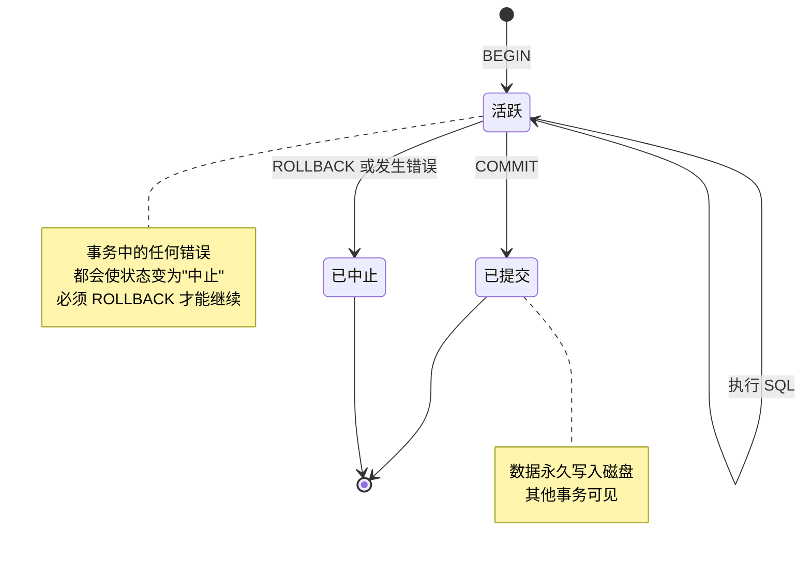
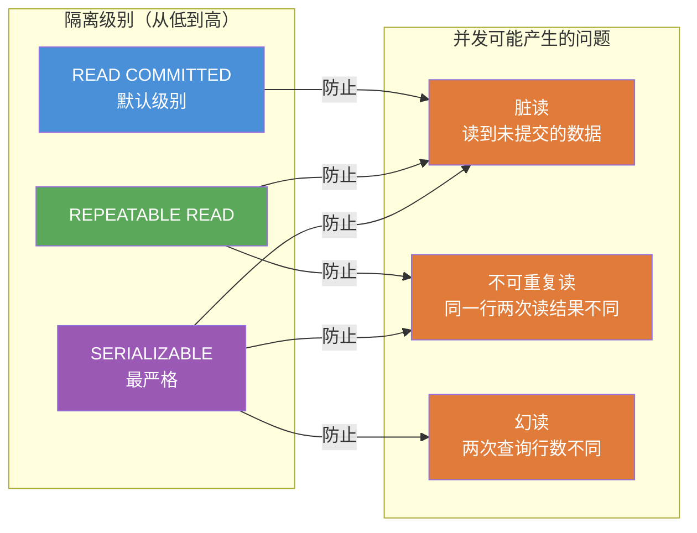

# PostgreSQL 事务处理

[TOC]

## 事务生命周期



## 隔离级别与并发问题



> PostgreSQL 的 REPEATABLE READ 额外防止了幻读，实际上比 SQL 标准要求的更强。

## 事务基础

PostgreSQL 默认每条 SQL 语句都在自己的事务中自动提交（autocommit 模式）。使用 `BEGIN` 开启显式事务块。

```sql
-- 开启事务
BEGIN;
-- 或
START TRANSACTION;

-- 提交事务
COMMIT;

-- 回滚事务
ROLLBACK;
```

### 基本事务示例

```sql
-- 删除订单（保证原子性）
BEGIN;

DELETE FROM orderitems WHERE order_num = 20010;
DELETE FROM orders WHERE order_num = 20010;

-- 检查无误后提交
COMMIT;

-- 如果有问题则回滚
-- ROLLBACK;
```

## 保留点（Savepoint）

```sql
BEGIN;

INSERT INTO orders(order_date, cust_id) VALUES (NOW(), 10001);
SAVEPOINT sp_order;                      -- 创建保留点

INSERT INTO orderitems(order_num, order_item, prod_id, quantity, item_price)
VALUES (currval('orders_order_num_seq'), 1, 'ANV01', 10, 5.99);
SAVEPOINT sp_item1;

-- 如果后续操作失败，只回滚到 sp_item1
INSERT INTO orderitems(order_num, order_item, prod_id, quantity, item_price)
VALUES (currval('orders_order_num_seq'), 2, 'INVALID_PROD', 1, 9.99);  -- 可能失败

ROLLBACK TO SAVEPOINT sp_item1;         -- 回滚到 sp_item1，保留之前的操作
-- RELEASE SAVEPOINT sp_item1;          -- 释放保留点（不回滚）

COMMIT;
```

## 事务隔离级别

PostgreSQL 支持 SQL 标准的四个隔离级别，实际提供三个（Repeatable Read 和 Serializable 有额外保证）：

| 隔离级别 | 脏读 | 不可重复读 | 幻读 |
|----------|------|------------|------|
| `READ UNCOMMITTED` | 不会（PG 升级为 RC） | 可能 | 可能 |
| `READ COMMITTED`（默认） | 不会 | 可能 | 可能 |
| `REPEATABLE READ` | 不会 | 不会 | 不会（PG 额外保证）|
| `SERIALIZABLE` | 不会 | 不会 | 不会 |

```sql
-- 设置事务隔离级别
BEGIN TRANSACTION ISOLATION LEVEL READ COMMITTED;
BEGIN TRANSACTION ISOLATION LEVEL REPEATABLE READ;
BEGIN TRANSACTION ISOLATION LEVEL SERIALIZABLE;

-- 在事务中设置
BEGIN;
SET TRANSACTION ISOLATION LEVEL SERIALIZABLE;

-- 只读事务（性能更好，明确告知 PostgreSQL 不会修改数据）
BEGIN TRANSACTION ISOLATION LEVEL REPEATABLE READ READ ONLY;

-- 设置会话默认隔离级别
SET SESSION CHARACTERISTICS AS TRANSACTION ISOLATION LEVEL SERIALIZABLE;
```

## 锁

```sql
-- 表级锁
LOCK TABLE orders IN ACCESS EXCLUSIVE MODE;   -- 最严格（只有自己可读写）
LOCK TABLE orders IN SHARE MODE;              -- 允许其他事务读，不允许写

-- 行级锁（SELECT FOR UPDATE）
BEGIN;
SELECT * FROM orders WHERE order_num = 20005 FOR UPDATE;  -- 锁定该行
-- 其他事务的 SELECT FOR UPDATE 会等待
UPDATE orders SET cust_id = 10002 WHERE order_num = 20005;
COMMIT;

-- FOR UPDATE NOWAIT（锁不到立即报错，不等待）
SELECT * FROM orders WHERE order_num = 20005 FOR UPDATE NOWAIT;

-- FOR UPDATE SKIP LOCKED（跳过已锁定的行，适合任务队列）
SELECT * FROM tasks WHERE status = 'pending' FOR UPDATE SKIP LOCKED LIMIT 1;

-- FOR SHARE（共享锁，允许其他事务读，但不允许 FOR UPDATE）
SELECT * FROM products WHERE prod_id = 'ANV01' FOR SHARE;

-- 查看当前锁
SELECT pid, locktype, relation::regclass, mode, granted
FROM pg_locks
WHERE relation IS NOT NULL;

-- 查看等待锁的查询
SELECT pid, wait_event_type, wait_event, state, query
FROM pg_stat_activity
WHERE wait_event IS NOT NULL;
```

## MVCC（多版本并发控制）

PostgreSQL 使用 MVCC 实现高并发，读操作不会阻塞写操作，写操作不会阻塞读操作。

```sql
-- VACUUM：清理已删除/更新的旧版本数据（"死元组"）
VACUUM orders;
VACUUM VERBOSE orders;              -- 显示详细信息
VACUUM ANALYZE orders;              -- 清理 + 更新统计信息
VACUUM FULL orders;                 -- 完全清理（会锁表，慎用）

-- ANALYZE：更新统计信息（帮助查询优化器做出更好的执行计划）
ANALYZE;                            -- 分析所有表
ANALYZE orders;                     -- 分析特定表
ANALYZE products (prod_price, vend_id);  -- 分析特定列

-- autovacuum 自动在后台运行 VACUUM，通常不需要手动执行
-- 查看 autovacuum 状态
SELECT relname, last_autovacuum, last_autoanalyze, n_dead_tup
FROM pg_stat_user_tables
ORDER BY n_dead_tup DESC;
```

## 错误处理与回滚

PostgreSQL 中事务块内的任何错误都会使整个事务进入"中止"状态，必须 ROLLBACK 才能继续。

```sql
BEGIN;

UPDATE accounts SET balance = balance - 100 WHERE id = 1;
-- 如果这里发生错误，以下语句都不会执行，且必须 ROLLBACK

UPDATE accounts SET balance = balance + 100 WHERE id = 2;

COMMIT;

-- 错误后的状态
-- ERROR: ...
-- 当前事务被中止，命令被忽略，直到事务结束
-- => ROLLBACK;  -- 必须先回滚才能继续
```

### 在 PL/pgSQL 中处理事务错误

```sql
CREATE OR REPLACE PROCEDURE transfer_money(
    p_from_id INTEGER,
    p_to_id   INTEGER,
    p_amount  NUMERIC
)
LANGUAGE plpgsql
AS $$
BEGIN
    UPDATE accounts SET balance = balance - p_amount WHERE id = p_from_id;

    IF NOT FOUND THEN
        RAISE EXCEPTION '账户 % 不存在', p_from_id;
    END IF;

    UPDATE accounts SET balance = balance + p_amount WHERE id = p_to_id;

    IF NOT FOUND THEN
        RAISE EXCEPTION '账户 % 不存在', p_to_id;
    END IF;

    -- 检查余额
    IF (SELECT balance FROM accounts WHERE id = p_from_id) < 0 THEN
        RAISE EXCEPTION '余额不足';
    END IF;

EXCEPTION
    WHEN OTHERS THEN
        RAISE NOTICE '转账失败：%', SQLERRM;
        RAISE;  -- 重新抛出，让调用者处理（存储过程中的 ROLLBACK 由调用方控制）
END;
$$;

CALL transfer_money(1, 2, 100.00);
```

## 两阶段提交（PREPARE TRANSACTION）

适用于分布式事务场景（较高级，日常开发很少用到）。

```sql
BEGIN;
INSERT INTO orders(order_date, cust_id) VALUES (NOW(), 10001);
PREPARE TRANSACTION 'txn_001';   -- 准备事务（不提交）

-- 稍后（甚至在不同连接中）
COMMIT PREPARED 'txn_001';      -- 提交
-- 或
ROLLBACK PREPARED 'txn_001';    -- 回滚

-- 查看待提交的事务
SELECT * FROM pg_prepared_xacts;
```
