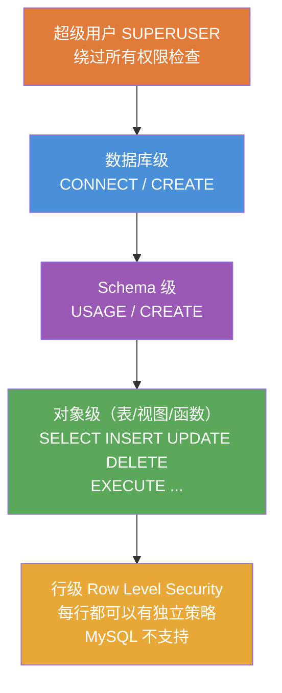
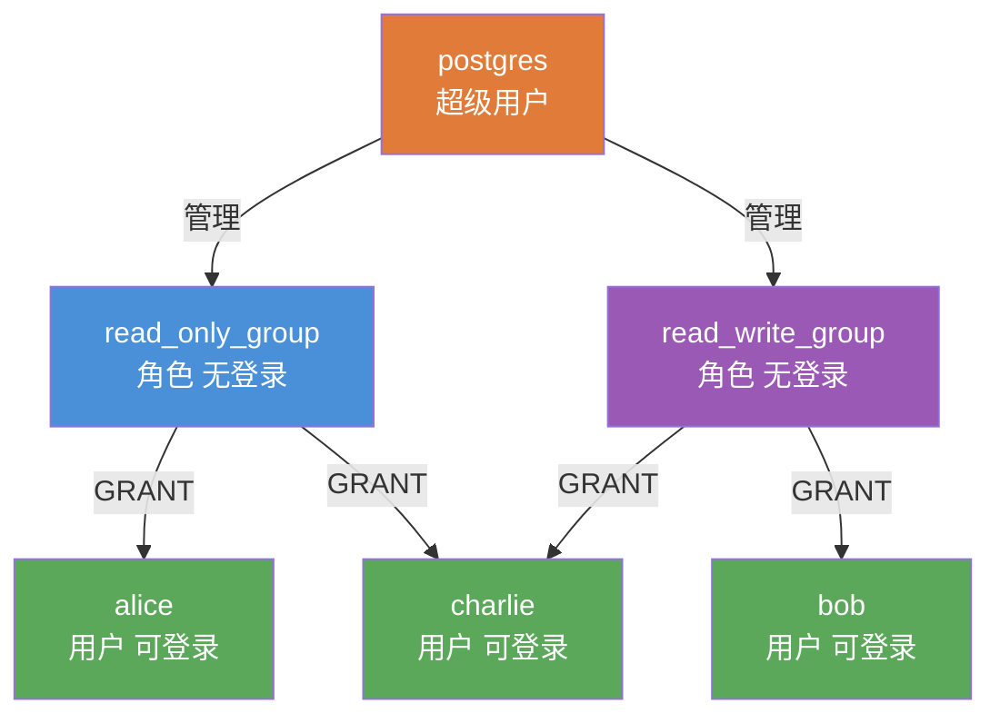

# PostgreSQL 用户与权限管理

PostgreSQL 将"用户"和"角色"统一为 **ROLE**，`CREATE USER` 是 `CREATE ROLE ... LOGIN` 的别名。

[TOC]

## 权限体系层级



## 角色与用户关系



> charlie 同时拥有两个角色的权限，角色可以叠加。

## 角色（Role）与用户（User）

```sql
-- 创建角色（无登录权限）
CREATE ROLE readonly_role;

-- 创建用户（有登录权限）
CREATE USER alice WITH PASSWORD 'secure_password';
-- 等同于：
CREATE ROLE alice WITH LOGIN PASSWORD 'secure_password';

-- 创建超级用户
CREATE USER admin_user WITH SUPERUSER PASSWORD 'admin_pass';

-- 创建只能创建数据库的用户
CREATE USER dbcreator WITH CREATEDB PASSWORD 'pass';

-- 创建可以创建角色的用户
CREATE USER rolemanager WITH CREATEROLE PASSWORD 'pass';

-- 创建有连接数限制和有效期的用户
CREATE USER temp_user
    WITH PASSWORD 'temp_pass'
    VALID UNTIL '2025-12-31'    -- 账号过期时间
    CONNECTION LIMIT 5;          -- 最大并发连接数
```

## 修改用户

```sql
-- 修改密码
ALTER USER alice WITH PASSWORD 'new_password';

-- 修改有效期
ALTER USER temp_user VALID UNTIL '2026-12-31';

-- 重命名
ALTER USER alice RENAME TO alice_new;

-- 锁定/解锁账号
ALTER USER alice NOLOGIN;    -- 禁止登录
ALTER USER alice LOGIN;      -- 恢复登录

-- 设置用户默认参数
ALTER USER alice SET search_path TO myschema, public;
ALTER USER alice SET timezone TO 'Asia/Shanghai';
ALTER USER alice RESET search_path;  -- 重置为系统默认
```

## 删除用户

```sql
DROP USER alice;
DROP USER IF EXISTS alice;
-- 注意：删除用户前，需先删除或转移其拥有的对象
-- 或使用：
REASSIGN OWNED BY alice TO postgres;   -- 将 alice 的对象转移给 postgres
DROP OWNED BY alice;                   -- 删除 alice 拥有的所有对象
DROP USER alice;
```

## 查看用户与角色

```sql
-- psql 命令
\du             -- 列出所有角色
\du alice       -- 查看特定角色

-- 系统表查询
SELECT rolname, rolsuper, rolinherit, rolcreaterole, rolcreatedb,
       rolcanlogin, rolconnlimit, rolvaliduntil
FROM pg_roles
ORDER BY rolname;

-- 查看当前用户
SELECT current_user, session_user;
```

## 授权（GRANT）

### 数据库级别权限

```sql
-- 允许用户连接数据库
GRANT CONNECT ON DATABASE mydb TO alice;

-- 允许用户在数据库中创建 schema
GRANT CREATE ON DATABASE mydb TO alice;
```

### Schema 级别权限

```sql
-- 允许用户使用 schema（查看其中对象）
GRANT USAGE ON SCHEMA myschema TO alice;

-- 允许用户在 schema 中创建对象
GRANT CREATE ON SCHEMA myschema TO alice;
```

### 表级别权限

```sql
-- 授予表的查询权限
GRANT SELECT ON TABLE products TO alice;
GRANT SELECT ON products TO alice;        -- TABLE 关键字可省略

-- 授予多种权限
GRANT SELECT, INSERT, UPDATE ON products TO alice;

-- 授予所有权限
GRANT ALL PRIVILEGES ON products TO alice;
GRANT ALL ON products TO alice;           -- 简写

-- 授予 schema 中所有表的权限
GRANT SELECT ON ALL TABLES IN SCHEMA public TO alice;
GRANT SELECT ON ALL TABLES IN SCHEMA myschema TO alice;

-- 授予未来创建的表的权限（DEFAULT PRIVILEGES）
ALTER DEFAULT PRIVILEGES IN SCHEMA public
    GRANT SELECT ON TABLES TO alice;

ALTER DEFAULT PRIVILEGES FOR ROLE developer IN SCHEMA public
    GRANT INSERT, UPDATE, DELETE ON TABLES TO alice;
```

### 列级别权限

```sql
-- 只允许访问特定列
GRANT SELECT (prod_name, prod_price) ON products TO alice;
GRANT UPDATE (cust_email) ON customers TO alice;
```

### 其他对象权限

```sql
-- 序列权限（允许 INSERT 时自增）
GRANT USAGE, SELECT ON SEQUENCE products_prod_id_seq TO alice;

-- 或批量授权所有序列
GRANT USAGE, SELECT ON ALL SEQUENCES IN SCHEMA public TO alice;

-- 函数权限
GRANT EXECUTE ON FUNCTION get_order_total(INTEGER) TO alice;
GRANT EXECUTE ON ALL FUNCTIONS IN SCHEMA public TO alice;
```

## 角色继承与组角色

```sql
-- 创建组角色（不能登录）
CREATE ROLE read_only_group NOLOGIN;
CREATE ROLE read_write_group NOLOGIN;

-- 为角色授权
GRANT SELECT ON ALL TABLES IN SCHEMA public TO read_only_group;
GRANT SELECT, INSERT, UPDATE, DELETE ON ALL TABLES IN SCHEMA public TO read_write_group;

-- 将用户加入角色组（用户继承角色的权限）
GRANT read_only_group TO alice;
GRANT read_write_group TO bob;

-- 一个用户可以属于多个角色
GRANT read_only_group TO charlie;
GRANT read_write_group TO charlie;

-- 查看角色成员关系
SELECT r.rolname AS role, m.rolname AS member
FROM pg_auth_members
JOIN pg_roles AS r ON r.oid = pg_auth_members.roleid
JOIN pg_roles AS m ON m.oid = pg_auth_members.member;

-- 切换到角色（在会话中临时获取角色权限）
SET ROLE read_write_group;
RESET ROLE;   -- 恢复原来的角色
```

## 撤销权限（REVOKE）

```sql
-- 撤销特定权限
REVOKE SELECT ON products FROM alice;
REVOKE SELECT ON ALL TABLES IN SCHEMA public FROM alice;
REVOKE ALL PRIVILEGES ON products FROM alice;

-- 撤销角色成员关系
REVOKE read_only_group FROM alice;

-- 撤销 DEFAULT PRIVILEGES
ALTER DEFAULT PRIVILEGES IN SCHEMA public
    REVOKE SELECT ON TABLES FROM alice;
```

## 行级安全（Row Level Security，RLS）

PostgreSQL 支持行级安全策略，控制用户只能看到/修改哪些行（MySQL 不原生支持）。

```sql
-- 启用行级安全
ALTER TABLE orders ENABLE ROW LEVEL SECURITY;

-- 创建策略：每个用户只能看自己的订单
CREATE POLICY user_orders_policy ON orders
    USING (cust_id = current_setting('app.current_user_id')::INTEGER);

-- 分别创建 SELECT / INSERT / UPDATE / DELETE 策略
CREATE POLICY select_own_orders ON orders
    FOR SELECT
    USING (cust_id = current_setting('app.current_user_id')::INTEGER);

CREATE POLICY insert_own_orders ON orders
    FOR INSERT
    WITH CHECK (cust_id = current_setting('app.current_user_id')::INTEGER);

-- 超级用户默认绕过 RLS，可强制其遵守：
ALTER TABLE orders FORCE ROW LEVEL SECURITY;

-- 设置当前用户 ID（应用层调用前设置）
SET app.current_user_id = '10001';

-- 查看策略
\d orders    -- psql 命令会显示策略
SELECT * FROM pg_policies WHERE tablename = 'orders';

-- 删除策略
DROP POLICY user_orders_policy ON orders;
ALTER TABLE orders DISABLE ROW LEVEL SECURITY;
```

## 权限查询

```sql
-- 查看表的权限
\dp products              -- psql 命令

SELECT grantee, privilege_type, is_grantable
FROM information_schema.role_table_grants
WHERE table_name = 'products';

-- 查看用户拥有的所有权限
SELECT table_schema, table_name, privilege_type
FROM information_schema.role_table_grants
WHERE grantee = 'alice';

-- 查看当前用户对表的权限
SELECT has_table_privilege('alice', 'products', 'SELECT');  -- true/false
SELECT has_column_privilege('alice', 'products', 'prod_price', 'SELECT');
SELECT has_schema_privilege('alice', 'public', 'USAGE');
```
