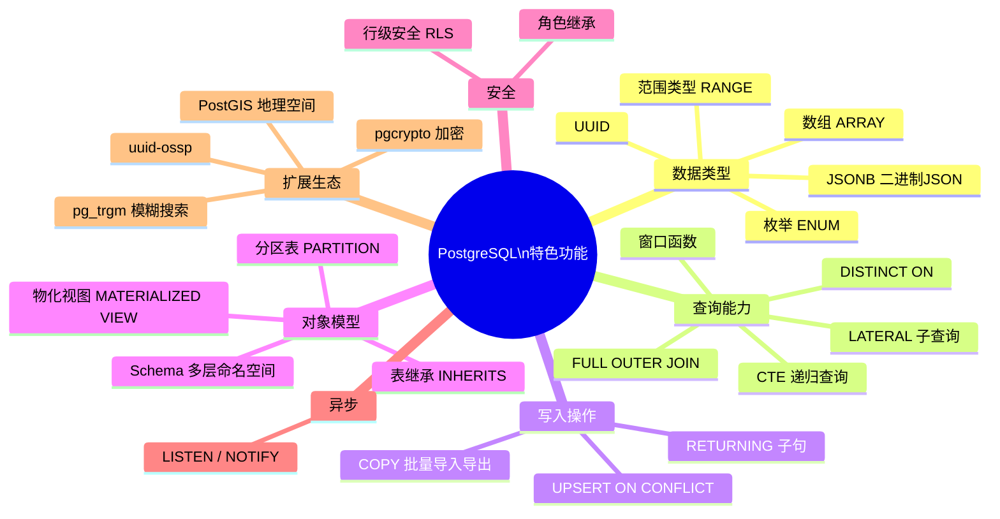

# PostgreSQL 特色功能

本章介绍 PostgreSQL 区别于 MySQL 的独特功能。

[TOC]

## PostgreSQL 独有特性全览



## UPSERT（INSERT ON CONFLICT）

```sql
-- ON CONFLICT DO NOTHING（冲突时忽略）
INSERT INTO products(prod_id, vend_id, prod_name, prod_price)
VALUES ('ANV01', 1001, '.5 ton anvil', 5.99)
ON CONFLICT DO NOTHING;

-- ON CONFLICT DO UPDATE（冲突时更新，即 UPSERT）
INSERT INTO products(prod_id, vend_id, prod_name, prod_price)
VALUES ('ANV01', 1001, '.5 ton anvil', 6.99)
ON CONFLICT (prod_id)                           -- 指定冲突的列（通常是主键/唯一键）
DO UPDATE SET
    prod_price = EXCLUDED.prod_price,           -- EXCLUDED 代表尝试插入的行
    prod_name  = EXCLUDED.prod_name;

-- 带条件的 UPDATE
INSERT INTO products(prod_id, prod_price)
VALUES ('ANV01', 6.99)
ON CONFLICT (prod_id)
DO UPDATE SET prod_price = EXCLUDED.prod_price
WHERE products.prod_price < EXCLUDED.prod_price;  -- 只在新价格更高时更新
```

## RETURNING 子句

```sql
-- INSERT 并返回插入后的数据（含自增 ID）
INSERT INTO customers(cust_name, cust_email)
VALUES ('New Customer', 'new@example.com')
RETURNING cust_id, cust_name;

-- UPDATE 并返回更新后的值
UPDATE products SET prod_price = prod_price * 1.1
WHERE vend_id = 1001
RETURNING prod_id, prod_name, prod_price;

-- DELETE 并返回被删除的行
DELETE FROM orderitems WHERE order_num = 20010
RETURNING *;

-- 与 CTE 配合批量操作
WITH deleted AS (
    DELETE FROM orders WHERE order_date < '2022-01-01'
    RETURNING order_num
)
INSERT INTO orders_archive
SELECT * FROM orders WHERE order_num IN (SELECT order_num FROM deleted);
```

## 扩展（Extensions）

PostgreSQL 通过扩展提供丰富的额外功能。

```sql
-- 查看已安装的扩展
SELECT * FROM pg_extension;
\dx    -- psql 命令

-- 查看可用扩展
SELECT * FROM pg_available_extensions ORDER BY name;

-- 安装扩展
CREATE EXTENSION IF NOT EXISTS "uuid-ossp";     -- UUID 生成
CREATE EXTENSION IF NOT EXISTS pgcrypto;         -- 加密函数
CREATE EXTENSION IF NOT EXISTS pg_trgm;          -- 模糊搜索（三元组索引）
CREATE EXTENSION IF NOT EXISTS unaccent;         -- 去除重音字符
CREATE EXTENSION IF NOT EXISTS postgis;          -- 地理空间数据
CREATE EXTENSION IF NOT EXISTS pg_stat_statements; -- SQL 执行统计
CREATE EXTENSION IF NOT EXISTS hstore;           -- 键值对类型
CREATE EXTENSION IF NOT EXISTS tablefunc;        -- CROSSTAB 等表函数

-- 删除扩展
DROP EXTENSION IF EXISTS "uuid-ossp";
```

### pg_trgm：模糊搜索

```sql
CREATE EXTENSION IF NOT EXISTS pg_trgm;

-- 创建三元组 GIN 索引（支持 LIKE/ILIKE 加速）
CREATE INDEX idx_products_name_trgm ON products USING GIN (prod_name gin_trgm_ops);

-- 模糊搜索（即使是 LIKE '%anvil%' 也能用到索引）
SELECT prod_name FROM products WHERE prod_name ILIKE '%anvil%';

-- 相似度函数
SELECT prod_name, similarity(prod_name, 'anvil') AS sim
FROM products
WHERE similarity(prod_name, 'anvil') > 0.3
ORDER BY sim DESC;
```

## COPY 与批量操作

```sql
-- 高性能批量导入（比 INSERT 快很多）
COPY products(prod_id, vend_id, prod_name, prod_price)
FROM '/path/to/data.csv'
WITH (FORMAT CSV, HEADER TRUE, DELIMITER ',', NULL '');

-- 导出
COPY (SELECT * FROM products WHERE vend_id = 1001)
TO '/path/to/output.csv'
WITH (FORMAT CSV, HEADER TRUE);

-- 客户端批量导入（psql \copy，读取本地文件）
\copy products FROM 'C:/data/products.csv' CSV HEADER
```

## LISTEN / NOTIFY（异步通知）

```sql
-- 发布端：发送通知
NOTIFY channel_name;                          -- 简单通知
NOTIFY order_created, '{"order_id": 20011}'; -- 带 payload

-- 在函数/触发器中发送通知
CREATE OR REPLACE FUNCTION notify_new_order()
RETURNS TRIGGER LANGUAGE plpgsql AS $$
BEGIN
    PERFORM pg_notify('order_created', row_to_json(NEW)::TEXT);
    RETURN NEW;
END;
$$;

CREATE TRIGGER trg_notify_order
AFTER INSERT ON orders FOR EACH ROW
EXECUTE FUNCTION notify_new_order();

-- 订阅端：监听通知
LISTEN order_created;
-- 之后客户端（如 psql）会收到通知消息，可在应用层（Node.js/Python 等）处理
UNLISTEN order_created;
UNLISTEN *;    -- 取消所有监听
```

## 统计与监控

```sql
-- 查看表的大小
SELECT pg_size_pretty(pg_total_relation_size('products'));   -- 含索引
SELECT pg_size_pretty(pg_relation_size('products'));          -- 只含表数据

-- 查看数据库大小
SELECT pg_size_pretty(pg_database_size('mydb'));

-- 查看所有表的大小（按大小排序）
SELECT
    tablename,
    pg_size_pretty(pg_total_relation_size(quote_ident(tablename))) AS total_size,
    pg_size_pretty(pg_relation_size(quote_ident(tablename))) AS table_size,
    pg_size_pretty(pg_indexes_size(quote_ident(tablename))) AS indexes_size
FROM pg_tables
WHERE schemaname = 'public'
ORDER BY pg_total_relation_size(quote_ident(tablename)) DESC;

-- 查看慢查询（需启用 pg_stat_statements）
CREATE EXTENSION IF NOT EXISTS pg_stat_statements;

SELECT query, calls, total_exec_time / calls AS avg_time_ms,
       rows / calls AS avg_rows
FROM pg_stat_statements
ORDER BY total_exec_time DESC
LIMIT 10;

-- 重置统计
SELECT pg_stat_reset();
SELECT pg_stat_statements_reset();

-- 查看表的访问统计
SELECT relname, seq_scan, idx_scan, n_live_tup, n_dead_tup
FROM pg_stat_user_tables
ORDER BY seq_scan DESC;

-- 查看索引使用率
SELECT indexrelname, idx_scan, idx_tup_read, idx_tup_fetch
FROM pg_stat_user_indexes
ORDER BY idx_scan DESC;
```

## 逻辑复制与备份

```sql
-- 备份（命令行工具，非 SQL）
-- pg_dump：备份单个数据库
-- pg_dump -U postgres -d mydb -f backup.sql       -- SQL 格式
-- pg_dump -U postgres -d mydb -Fc -f backup.dump  -- 自定义格式（推荐，支持并行）

-- pg_dumpall：备份所有数据库（含角色）
-- pg_dumpall -U postgres -f all_backup.sql

-- 恢复
-- psql -U postgres -d mydb -f backup.sql
-- pg_restore -U postgres -d mydb backup.dump

-- 发布订阅（逻辑复制，PostgreSQL 10+）
-- 发布端
CREATE PUBLICATION my_pub FOR TABLE orders, orderitems;
CREATE PUBLICATION my_pub FOR ALL TABLES;

-- 订阅端
CREATE SUBSCRIPTION my_sub
    CONNECTION 'host=primary_host dbname=mydb user=replication_user'
    PUBLICATION my_pub;
```

## JSON 高级操作

```sql
-- JSON 路径查询（jsonpath，PostgreSQL 12+）
SELECT * FROM events
WHERE data @? '$.tags[*] ? (@ == "admin")';

SELECT jsonb_path_query(data, '$.tags[*]') AS tag
FROM events;

SELECT jsonb_path_query_first(data, '$.meta.ip') AS ip
FROM events;

-- JSON 聚合与构建
SELECT
    vend_id,
    jsonb_build_object(
        'vendor_id', vend_id,
        'products', jsonb_agg(
            jsonb_build_object('id', prod_id, 'name', prod_name, 'price', prod_price)
            ORDER BY prod_price
        )
    ) AS vendor_data
FROM products
GROUP BY vend_id;

-- 行转 JSON
SELECT row_to_json(p) FROM products AS p LIMIT 3;
SELECT to_jsonb(p) FROM products AS p LIMIT 3;
```

## GENERATED COLUMNS（生成列）

```sql
-- STORED：计算值存储在磁盘
-- VIRTUAL：查询时计算（PostgreSQL 目前只支持 STORED）
CREATE TABLE orderitems_v2 (
    order_num   INTEGER NOT NULL,
    order_item  INTEGER NOT NULL,
    quantity    INTEGER NOT NULL,
    item_price  NUMERIC(8,2) NOT NULL,
    line_total  NUMERIC(10,2) GENERATED ALWAYS AS (quantity * item_price) STORED,
    PRIMARY KEY (order_num, order_item)
);

INSERT INTO orderitems_v2(order_num, order_item, quantity, item_price)
VALUES (20005, 1, 10, 5.99);

SELECT * FROM orderitems_v2;
-- line_total 自动计算为 59.90
```

## 常用管理查询

```sql
-- 查看长时间运行的查询
SELECT pid, now() - query_start AS duration, query, state
FROM pg_stat_activity
WHERE state != 'idle'
AND now() - query_start > INTERVAL '5 minutes'
ORDER BY duration DESC;

-- 终止某个查询（软终止，等待当前操作完成）
SELECT pg_cancel_backend(pid);

-- 强制终止连接（立即断开）
SELECT pg_terminate_backend(pid);

-- 查看表膨胀（dead tuples）
SELECT schemaname, tablename, n_dead_tup, n_live_tup,
       ROUND(n_dead_tup::NUMERIC / NULLIF(n_live_tup + n_dead_tup, 0) * 100, 2) AS dead_ratio
FROM pg_stat_user_tables
WHERE n_dead_tup > 0
ORDER BY dead_ratio DESC;

-- 查看等待锁的情况
SELECT
    blocked.pid AS blocked_pid,
    blocking.pid AS blocking_pid,
    blocked.query AS blocked_query,
    blocking.query AS blocking_query
FROM pg_stat_activity AS blocked
JOIN pg_stat_activity AS blocking
    ON blocking.pid = ANY(pg_blocking_pids(blocked.pid))
WHERE cardinality(pg_blocking_pids(blocked.pid)) > 0;

-- 重置序列（修复 ID 不连续问题）
SELECT setval('customers_cust_id_seq', (SELECT MAX(cust_id) FROM customers));
```

## MySQL 与 PostgreSQL 主要语法对比

| 功能 | MySQL | PostgreSQL |
|------|-------|------------|
| 自增主键 | `INT AUTO_INCREMENT` | `SERIAL` 或 `GENERATED ALWAYS AS IDENTITY` |
| 字符串拼接 | `CONCAT(a, b)` | `a \|\| b` 或 `CONCAT(a, b)` |
| 当前时间 | `NOW()` | `NOW()` / `CURRENT_TIMESTAMP` |
| 日期格式化 | `DATE_FORMAT(d, '%Y-%m')` | `TO_CHAR(d, 'YYYY-MM')` |
| 字符串截取 | `SUBSTRING(s, 1, 3)` | `SUBSTRING(s FROM 1 FOR 3)` 或 `SUBSTR(s, 1, 3)` |
| 不区分大小写 LIKE | `LIKE`（默认不区分） | `ILIKE` |
| 正则匹配 | `REGEXP` | `~`（区分大小写）/ `~*`（不区分）|
| 随机数 | `RAND()` | `RANDOM()` |
| 分组拼接 | `GROUP_CONCAT(col)` | `STRING_AGG(col, ',')` |
| 类型转换 | `CAST(x AS INT)` | `x::INT` 或 `CAST(x AS INT)` |
| UPSERT | `INSERT ... ON DUPLICATE KEY UPDATE` | `INSERT ... ON CONFLICT DO UPDATE` |
| 限制行数 | `LIMIT 10, 5` | `LIMIT 5 OFFSET 10` |
| 显示表结构 | `DESCRIBE table` | `\d table`（psql）|
| 全文搜索 | `MATCH ... AGAINST` | `tsvector @@ tsquery` |
| JSON 提取 | `JSON_EXTRACT(data, '$.key')` | `data->'key'` 或 `data->>'key'` |
| 存储引擎 | InnoDB / MyISAM | 统一（无需指定）|
