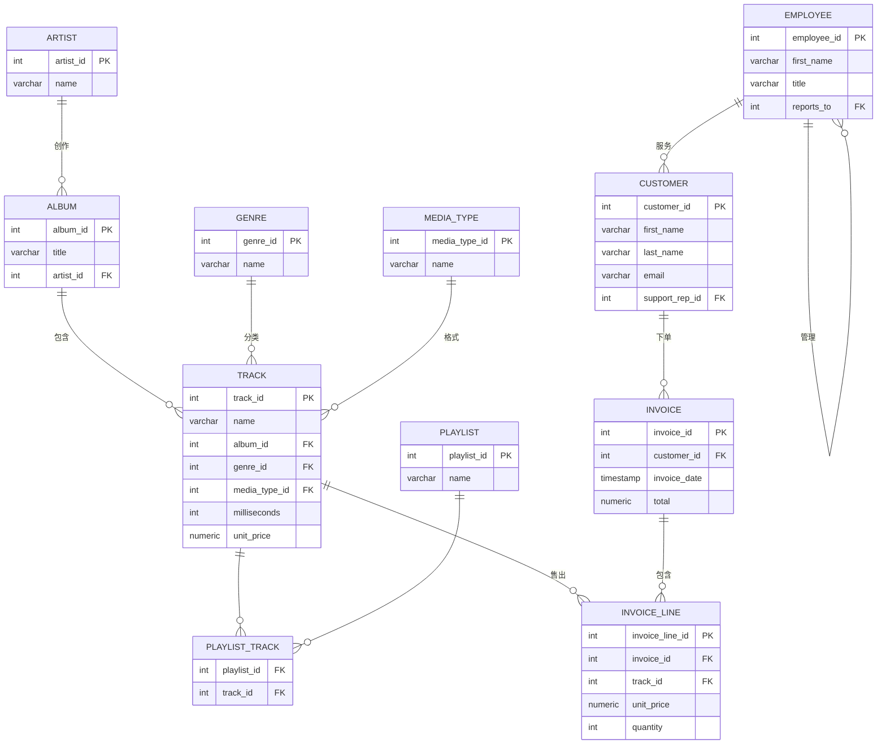

# PostgreSQL 本地练习环境搭建指南

> **运行环境：PostgreSQL**（Chinook 数据库，Docker 容器）

使用 **Docker + Chinook 数据库** 在本地搭建 PostgreSQL 练习环境。

## Chinook 数据库简介

Chinook 是一个模拟数字音乐商店的数据库，共 11 张表，约 2 万行数据：

| 表名 | 说明 | 大致行数 |
|------|------|---------|
| `artist` | 艺术家 | 275 |
| `album` | 专辑 | 347 |
| `track` | 曲目 | 3503 |
| `genre` | 音乐流派 | 25 |
| `media_type` | 媒体格式 | 5 |
| `playlist` | 播放列表 | 18 |
| `playlist_track` | 播放列表曲目（中间表） | 8715 |
| `customer` | 客户 | 59 |
| `employee` | 员工 | 8 |
| `invoice` | 发票/订单 | 412 |
| `invoice_line` | 发票明细 | 2240 |

---

## 第一步：启动 PostgreSQL 容器

确保 Docker Desktop 已启动，然后在 PowerShell 中运行：

```powershell
docker run -d `
  --name chinook-pg `
  -e POSTGRES_PASSWORD=postgres `
  -p 5432:5432 `
  postgres:17
```

验证容器正在运行：

```powershell
docker ps
# 应该能看到 chinook-pg 状态为 Up
```

---

## 第二步：下载 Chinook SQL 文件

在 PowerShell 中直接下载（无需浏览器）：

```powershell
# 下载到当前目录
Invoke-WebRequest `
  -Uri "https://raw.githubusercontent.com/lerocha/chinook-database/master/ChinookDatabase/DataSources/Chinook_PostgreSql.sql" `
  -OutFile "Chinook_PostgreSql.sql"
```

---

## 第三步：导入数据

```powershell
# 1. 把 SQL 文件复制进容器
docker cp Chinook_PostgreSql.sql chinook-pg:/tmp/

# 2. 创建数据库
docker exec -it chinook-pg psql -U postgres -c "CREATE DATABASE chinook;"

# 3. 导入数据（需要约 10-30 秒）
docker exec -it chinook-pg psql -U postgres -d chinook -f /tmp/Chinook_PostgreSql.sql
```

---

## 第四步：验证安装

进入 psql 控制台：

```powershell
docker exec -it chinook-pg psql -U postgres -d chinook
```

运行以下命令检查：

```sql
-- 查看所有表
\dt

-- 检查各表行数
SELECT 'artist' AS tbl, COUNT(*) FROM artist
UNION ALL SELECT 'album',   COUNT(*) FROM album
UNION ALL SELECT 'track',   COUNT(*) FROM track
UNION ALL SELECT 'customer',COUNT(*) FROM customer
UNION ALL SELECT 'invoice', COUNT(*) FROM invoice
ORDER BY tbl;

-- 预期输出：
--    tbl    | count
-- ----------+-------
--  album    |   347
--  artist   |   275
--  customer |    59
--  invoice  |   412
--  track    |  3503

-- 退出 psql
\q
```

---

## 第五步：连接 GUI 工具（推荐 DBeaver）

如果还没有 GUI 工具，推荐安装 **DBeaver**（免费）：https://dbeaver.io/download/

DBeaver 连接参数：

| 参数 | 值 |
|------|----|
| Host | `localhost` |
| Port | `5432` |
| Database | `chinook` |
| Username | `postgres` |
| Password | `postgres` |

---

## 日常启停

```powershell
# 停止容器（数据保留）
docker stop chinook-pg

# 再次启动
docker start chinook-pg

# 查看容器状态
docker ps -a

# 完全删除（数据也会丢失）
docker rm -f chinook-pg
```

---

## 练习题（由浅入深）

### Level 1 — 基础查询

```sql
-- 1. 查看所有艺术家，按名字字母排序
SELECT * FROM artist ORDER BY name;

-- 2. 查看所有流派
SELECT * FROM genre;

-- 3. 找出所有单价超过 1 美元的曲目（只显示名称和单价）
SELECT name, unit_price FROM track WHERE unit_price > 1 ORDER BY unit_price DESC;

-- 4. 找出名字里包含 "Love" 的曲目（不区分大小写）
SELECT name FROM track WHERE name ILIKE '%love%';

-- 5. 统计共有多少首曲目
SELECT COUNT(*) FROM track;
```

### Level 2 — 聚合与分组

```sql
-- 6. 每个流派有多少首曲目？按数量降序
SELECT g.name AS genre, COUNT(t.track_id) AS track_count
FROM genre g
LEFT JOIN track t ON g.genre_id = t.genre_id
GROUP BY g.name
ORDER BY track_count DESC;

-- 7. 每位艺术家有多少张专辑？只显示超过 5 张的
SELECT ar.name AS artist, COUNT(al.album_id) AS album_count
FROM artist ar
JOIN album al ON ar.artist_id = al.artist_id
GROUP BY ar.name
HAVING COUNT(al.album_id) > 5
ORDER BY album_count DESC;

-- 8. 每个国家的客户数量
SELECT country, COUNT(*) AS customer_count
FROM customer
GROUP BY country
ORDER BY customer_count DESC;

-- 9. 销售额最高的前 10 个客户（姓名 + 总消费金额）
SELECT
    c.first_name || ' ' || c.last_name AS customer_name,
    ROUND(SUM(i.total)::NUMERIC, 2) AS total_spent
FROM customer c
JOIN invoice i ON c.customer_id = i.customer_id
GROUP BY c.customer_id, c.first_name, c.last_name
ORDER BY total_spent DESC
LIMIT 10;

-- 10. 平均曲目时长最长的前 5 个流派（时长单位为毫秒，转换为分钟）
SELECT
    g.name AS genre,
    ROUND(AVG(t.milliseconds) / 60000.0, 2) AS avg_minutes
FROM genre g
JOIN track t ON g.genre_id = t.genre_id
GROUP BY g.name
ORDER BY avg_minutes DESC
LIMIT 5;
```

### Level 3 — 多表 JOIN 与子查询

```sql
-- 11. 列出所有专辑名、艺术家名和曲目数量
SELECT
    ar.name AS artist,
    al.title AS album,
    COUNT(t.track_id) AS track_count
FROM artist ar
JOIN album al ON ar.artist_id = al.artist_id
JOIN track t ON al.album_id = t.album_id
GROUP BY ar.name, al.title
ORDER BY ar.name, al.title;

-- 12. 找出从未被购买过的曲目（曲目不在任何发票明细里）
SELECT t.name FROM track t
WHERE NOT EXISTS (
    SELECT 1 FROM invoice_line il WHERE il.track_id = t.track_id
);

-- 13. 每位员工负责的客户数（包括没有客户的员工）
SELECT
    e.first_name || ' ' || e.last_name AS employee,
    e.title,
    COUNT(c.customer_id) AS customer_count
FROM employee e
LEFT JOIN customer c ON c.support_rep_id = e.employee_id
GROUP BY e.employee_id, e.first_name, e.last_name, e.title
ORDER BY customer_count DESC;

-- 14. 销售额最高的月份（按年月汇总）
SELECT
    TO_CHAR(invoice_date, 'YYYY-MM') AS month,
    ROUND(SUM(total)::NUMERIC, 2) AS monthly_revenue
FROM invoice
GROUP BY TO_CHAR(invoice_date, 'YYYY-MM')
ORDER BY monthly_revenue DESC
LIMIT 5;

-- 15. 每张专辑的总时长（转为 分:秒 格式）
SELECT
    al.title AS album,
    ar.name AS artist,
    TO_CHAR(
        (SUM(t.milliseconds) / 1000 || ' seconds')::INTERVAL,
        'MI:SS'
    ) AS total_duration
FROM album al
JOIN artist ar ON al.artist_id = ar.artist_id
JOIN track t ON al.album_id = t.album_id
GROUP BY al.title, ar.name
ORDER BY SUM(t.milliseconds) DESC
LIMIT 10;
```

### Level 4 — 窗口函数（PostgreSQL 特性）

```sql
-- 16. 每个流派内，曲目按单价的排名
SELECT
    g.name AS genre,
    t.name AS track,
    t.unit_price,
    RANK() OVER (PARTITION BY g.genre_id ORDER BY t.unit_price DESC) AS price_rank
FROM track t
JOIN genre g ON t.genre_id = g.genre_id
ORDER BY g.name, price_rank;

-- 17. 每位客户的累计消费金额（按时间顺序）
SELECT
    c.first_name || ' ' || c.last_name AS customer,
    i.invoice_date,
    i.total,
    SUM(i.total) OVER (
        PARTITION BY c.customer_id
        ORDER BY i.invoice_date
    ) AS running_total
FROM customer c
JOIN invoice i ON c.customer_id = i.customer_id
ORDER BY customer, i.invoice_date;

-- 18. 每月销售额与上月对比（环比）
WITH monthly AS (
    SELECT
        TO_CHAR(invoice_date, 'YYYY-MM') AS month,
        SUM(total) AS revenue
    FROM invoice
    GROUP BY TO_CHAR(invoice_date, 'YYYY-MM')
)
SELECT
    month,
    ROUND(revenue::NUMERIC, 2) AS revenue,
    ROUND(LAG(revenue) OVER (ORDER BY month)::NUMERIC, 2) AS prev_month,
    ROUND((revenue - LAG(revenue) OVER (ORDER BY month))::NUMERIC, 2) AS diff
FROM monthly
ORDER BY month;

-- 19. 每个艺术家销售额排名（用 DENSE_RANK）
SELECT
    ar.name AS artist,
    ROUND(SUM(il.unit_price * il.quantity)::NUMERIC, 2) AS total_sales,
    DENSE_RANK() OVER (ORDER BY SUM(il.unit_price * il.quantity) DESC) AS sales_rank
FROM artist ar
JOIN album al ON ar.artist_id = al.artist_id
JOIN track t ON al.album_id = t.album_id
JOIN invoice_line il ON t.track_id = il.track_id
GROUP BY ar.artist_id, ar.name
ORDER BY sales_rank
LIMIT 20;

-- 20. 找出每个客户最近一次购买记录
SELECT DISTINCT ON (customer_id)
    customer_id,
    invoice_date AS last_purchase,
    total AS last_amount
FROM invoice
ORDER BY customer_id, invoice_date DESC;
```

---

## 数据库结构速查（ER 关系图）



---

## 常用 psql 命令速查

```sql
\dt             -- 列出所有表
\d track        -- 查看 track 表结构
\x              -- 切换竖向显示（看宽结果很好用）
\timing         -- 显示查询耗时
\e              -- 用编辑器编辑 SQL
\q              -- 退出
```

---

### Level 5 — EXPLAIN 查询计划分析

> 目标：学会用 `EXPLAIN` / `EXPLAIN ANALYZE` 读懂查询计划，发现性能瓶颈并修复。

**关键字段速查：**

| 字段 | 含义 | 好的信号 | 坏的信号 |
|------|------|----------|----------|
| `Seq Scan` | 全表扫描 | 小表 OK | 大表上应走索引 |
| `Index Scan` | 索引扫描 | ✅ | — |
| `Index Only Scan` | 覆盖索引（不回表） | ✅✅ | — |
| `Hash Join` | 哈希连接 | 大表 JOIN 常见 | — |
| `Nested Loop` | 嵌套循环 | 小结果集 | 大结果集时很慢 |
| `rows` | 预估扫描行数 | 越少越好 | 远大于实际行数说明统计信息过期 |
| `cost` | 启动代价..总代价 | 越小越好 | — |
| `actual time` | 实际执行毫秒（需 ANALYZE） | — | 远大于 cost 说明问题 |

---

#### E1. 基线：观察无索引时的全表扫描

```sql
-- 先看没有索引时的情况
EXPLAIN SELECT * FROM track WHERE name = 'Black Dog';
```

**预期输出关键词：** `Seq Scan on track` — 全表扫描 3503 行。

```sql
-- 加上 ANALYZE 看实际执行时间
EXPLAIN ANALYZE SELECT * FROM track WHERE name = 'Black Dog';
```

**问题：** 为什么这里是 Seq Scan？track.name 有索引吗？

---

#### E2. 创建索引，对比前后

```sql
-- 创建索引
CREATE INDEX idx_track_name ON track(name);

-- 再次查看查询计划
EXPLAIN ANALYZE SELECT * FROM track WHERE name = 'Black Dog';
```

**观察：** 输出应从 `Seq Scan` 变为 `Index Scan`。对比两次的 `actual time`。

```sql
-- 清理：练习完可以删掉（不影响后续练习）
DROP INDEX idx_track_name;
```

---

#### E3. LIKE 前缀 vs 中缀 — 索引能否命中

```sql
CREATE INDEX idx_track_name2 ON track(name);

-- 前缀匹配：能走索引
EXPLAIN ANALYZE SELECT name FROM track WHERE name LIKE 'Black%';

-- 中缀匹配：走不了普通 B-Tree 索引
EXPLAIN ANALYZE SELECT name FROM track WHERE name LIKE '%Black%';

DROP INDEX idx_track_name2;
```

**观察：** 第二条查询仍为 `Seq Scan`。记住：`LIKE '%xxx%'` 必须用全文搜索或 `pg_trgm` 扩展。

---

#### E4. JOIN 计划分析

```sql
-- 三表 JOIN：track → album → artist
EXPLAIN ANALYZE
SELECT ar.name AS artist, al.title AS album, t.name AS track
FROM track t
JOIN album al ON t.album_id = al.album_id
JOIN artist ar ON al.artist_id = ar.artist_id
WHERE ar.name = 'AC/DC';
```

**观察：**
- JOIN 类型是 `Hash Join` 还是 `Nested Loop`？为什么？
- `ar.name = 'AC/DC'` 上有索引吗？如果没有，WHERE 过滤发生在哪一步？

---

#### E5. 覆盖索引（Index Only Scan）

```sql
-- 创建覆盖索引：查询只需要 name 和 unit_price 两列
CREATE INDEX idx_track_name_price ON track(name, unit_price);

-- 查询只用到这两列 → Index Only Scan（不回表）
EXPLAIN ANALYZE
SELECT name, unit_price FROM track WHERE name LIKE 'B%';

-- 加入不在索引里的列 → 退化为 Index Scan（需回表）
EXPLAIN ANALYZE
SELECT name, unit_price, milliseconds FROM track WHERE name LIKE 'B%';

DROP INDEX idx_track_name_price;
```

**观察：** 第一条出现 `Index Only Scan`；第二条因为要取 `milliseconds` 必须回表，退化为 `Index Scan`。

---

#### E6. 聚合查询计划

```sql
-- 按 genre 统计曲目数量
EXPLAIN ANALYZE
SELECT g.name, COUNT(t.track_id)
FROM genre g
LEFT JOIN track t ON g.genre_id = t.genre_id
GROUP BY g.name
ORDER BY COUNT(t.track_id) DESC;
```

**观察：** 注意 `HashAggregate` 节点——GROUP BY 通常用哈希聚合实现。`Sort` 节点对应 ORDER BY。

---

#### E7. 子查询 vs CTE 的计划差异

```sql
-- 子查询版本
EXPLAIN ANALYZE
SELECT c.first_name, c.last_name
FROM customer c
WHERE c.customer_id IN (
    SELECT i.customer_id FROM invoice i WHERE i.total > 20
);

-- CTE 版本
EXPLAIN ANALYZE
WITH big_invoices AS (
    SELECT customer_id FROM invoice WHERE total > 20
)
SELECT c.first_name, c.last_name
FROM customer c
JOIN big_invoices b ON c.customer_id = b.customer_id;
```

**观察：** PostgreSQL 12+ 通常会把简单 CTE 内联优化（inline），两者计划可能相同。注意 `Subquery Scan` 节点是否出现。

---

#### E8. 大分页的代价

```sql
-- 传统 OFFSET 分页：OFFSET 越大越慢
EXPLAIN ANALYZE
SELECT track_id, name FROM track ORDER BY track_id LIMIT 20 OFFSET 3000;

-- 游标分页（Keyset）：永远只扫描目标附近的行
EXPLAIN ANALYZE
SELECT track_id, name FROM track
WHERE track_id > 3000
ORDER BY track_id
LIMIT 20;
```

**观察：** OFFSET 版本需要扫描前 3020 行再丢弃；游标版本直接定位到 `track_id > 3000`，rows 估算应远小于前者。
